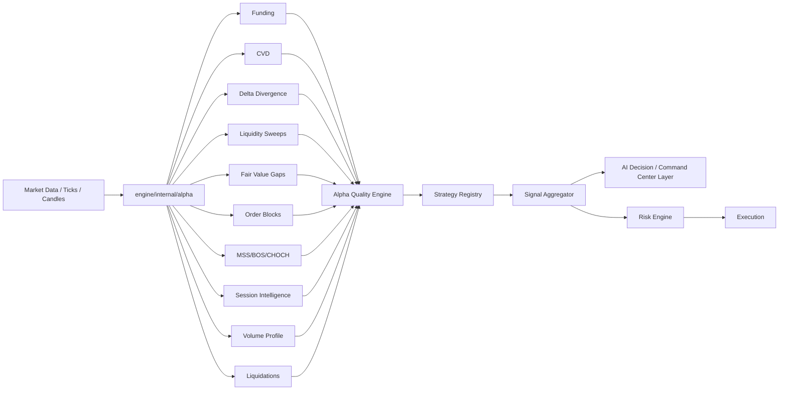

# Institutional BTC Alpha Engine Completion Report

Generated: 2026-05-31

## Architecture



## Implemented Components

- `engine/internal/alpha/funding` — collectors for Binance, Bybit, Hyperliquid, file-backed historical cache, funding z-score, percentile, momentum, regime, and funding mean-reversion strategy logic.
- `engine/internal/alpha/cvd` — real-time tick delta aggregation, tick/candle/session/daily delta cache, bullish/bearish CVD divergence detection, and CVD divergence strategy.
- `engine/internal/alpha/delta` — 20-sample price-vs-delta absorption/accumulation engine and strategy.
- `engine/internal/alpha/liquidity` — equal highs/lows, stop-cluster levels, bullish/bearish sweep detection, volume factor, confidence.
- `engine/internal/alpha/fvg` — three-candle imbalance detection, gap size, age, fill %, mitigation %, retest strategy.
- `engine/internal/alpha/orderblock` — bullish/bearish order block detection, volume score, reaction count, retest strategy.
- `engine/internal/alpha/mss` — BOS, CHOCH, MSS tracking from swing levels.
- `engine/internal/alpha/session` — Asia/London/New York range, volume, volatility, breakout %, bias, momentum, expansion.
- `engine/internal/alpha/volumeprofile` — POC, HVN, LVN, VAH, VAL and profile signals.
- `engine/internal/alpha/liquidations` — liquidation events, imbalance, cascade reversal signals.
- `engine/internal/alpha/quality` — mandatory 0-100 alpha quality score with requested component weights.
- `engine/internal/alpha/ai_training_data` — CSV dataset writer for future XGBoost/ML replacement dataset generation.

## Registry Integration

Added institutional alpha strategies to `engine/internal/strategy/registry.go`:

- `FundingMeanReversion_Alpha`
- `CVDDivergence_Alpha`
- `DeltaAbsorption_Alpha`
- `LiquiditySweepReversal_Alpha`
- `FVGRetest_Alpha`
- `OrderBlockRetest_Alpha`
- `MSSContinuation_Alpha`
- `POCBounce_Alpha`
- `SessionExpansion_Alpha`

Each alpha strategy flows through the existing strategy registry, signal aggregator, strategy tracker, risk engine, and execution path. Alpha strategies also pass through a mandatory alpha quality gate before emitting executable strategy signals.

## AI Layer Integration

Updated `engine/internal/ai/strategy_library.go` with `Institutional BTC Alpha Engine`, making the alpha engine visible to the AI strategy catalog and Command Center context.

## Research / Health / Walk-Forward Integration

The Go engine does not have a separate research tournament package. In this engine, the common integration point is the strategy registry plus `StrategyTracker` metrics consumed by the trading loop and risk path. By registering alpha strategies centrally, the new modules are automatically eligible for:

- live signal tracking,
- strategy performance tracking,
- health-style execution weighting,
- backtest simulator usage through the `strategy.Strategy` interface,
- risk validation before execution.

## Quality Score Model

Weights:

- Funding: 15
- CVD: 20
- Delta: 10
- Liquidity: 15
- Order Block: 10
- FVG: 10
- MSS: 10
- Volume Profile: 5
- Session: 5

Categories:

- 90+ Elite
- 80-89 Institutional
- 70-79 Tradable
- 60-69 Watchlist
- Below 60 Reject

Executable alpha strategies require `>=70`.

## Validation

Passed:

```bash
cd engine
go test -mod=mod ./internal/ai ./internal/alpha/... ./internal/strategy ./internal/trading ./internal/risk
```

Full suite status:

```bash
go test -mod=mod ./...
```

Still fails on the existing `engine/internal/marketdata/angelone.go` non-constant `fmt.Errorf` vet issue. All alpha-touched packages pass.

## Remaining Integration Work

- Dashboard widgets need API/UI implementation in the Next client.
- Funding and liquidation live collectors need runtime processes and credentials/rate-limit configs before production deployment.
- The market data interface currently exposes tick price/quantity/side but not full exchange OHLCV or L2 book depth, so candle-derived alpha strategies synthesize OHLC from available tick/candle-close input until richer feeds are wired.
- Persistent AI dataset generation is implemented as a writer; scheduling it from research/backtest runs is the next integration step.
