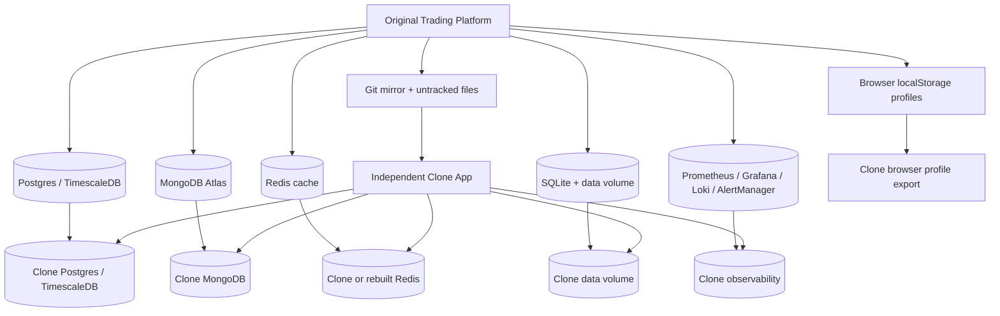

# Clone Execution Plan

Generated from repository discovery on 2026-06-02.

## Clone Architecture



## Phase 0: Freeze And Evidence Capture

1. Announce clone window.
2. Enable kill switch or stop trading writers.
3. Stop PM2 paper worker.
4. Disable Vercel cron or block with rotated `CRON_SECRET`.
5. Capture metadata:

```bash
git rev-parse HEAD
git status --short
git count-objects -vH
```

6. Record service versions:

```bash
node --version
npm --version
go version
python --version
docker version
```

## Phase 1: Repository Clone

Preferred:

```bash
git clone --mirror <original-url> trading-platform.git
git clone trading-platform.git trading-platform-clone
```

Local bundle alternative:

```bash
git bundle create trading-platform.bundle --all
git clone trading-platform.bundle trading-platform-clone
```

Copy untracked state:

- `RESEARCH DOCS/`
- `data/`
- `engine/c`
- `engine/cover_v3.out`
- `engine/internal/certification/`

Validate:

```bash
git -C trading-platform-clone rev-parse HEAD
git -C trading-platform-clone fsck --full
```

## Phase 2: Dependency Install

```bash
cd client && npm install --legacy-peer-deps --ignore-scripts
cd ../bridge && npm install
cd ../engine && go mod download
cd ../infrastructure/ai && pip install -r requirements.txt
```

Build validation:

```bash
cd client && npm run build
cd ../engine && go build ./...
```

## Phase 3: Database Export

Postgres/Timescale:

```bash
pg_dump "$DATABASE_URL" --format=custom --blobs --no-owner --no-acl --file=postgres_full.dump
pg_dump "$DATABASE_URL" --schema-only --no-owner --no-acl --file=postgres_schema.sql
```

MongoDB:

```bash
mongodump --uri "$MONGODB_URI" --db "$MONGODB_DB" --out mongo_dump
```

SQLite:

```bash
sqlite3 "$SQLITE_PATH" ".backup 'engine_clone.db'"
```

Redis, only if required:

```bash
redis-cli --rdb redis_dump.rdb
redis-cli --scan > redis_keys.txt
```

## Phase 4: Database Import

Postgres/Timescale:

```bash
createdb "$CLONE_DATABASE"
pg_restore --dbname "$CLONE_DATABASE_URL" --clean --if-exists --no-owner postgres_full.dump
```

MongoDB:

```bash
mongorestore --uri "$CLONE_MONGODB_URI" --db "$CLONE_MONGODB_DB" --drop mongo_dump/$MONGODB_DB
```

SQLite:

```bash
cp engine_clone.db clone/data/engine.db
sqlite3 clone/data/engine.db "PRAGMA integrity_check;"
```

Redis:

- Prefer rebuild from ledger/projections for cold clone.
- Restore RDB only for warm/live clone with active idempotency/order cache needs.

## Phase 5: Ledger Export And Verification

Capture original:

```sql
select count(*) from ledger_events;
select max(global_sequence) from ledger_events;
select count(*) from ledger_snapshots;
select count(distinct aggregate_type || ':' || aggregate_id) from ledger_events;
```

Validate clone:

```sql
select aggregate_type, aggregate_id, count(*) c, max(aggregate_sequence) m
from ledger_events
group by aggregate_type, aggregate_id
having count(*) <> max(aggregate_sequence);
```

Expected: zero rows.

## Phase 6: Configuration And Secrets

1. Create clone secret store.
2. Import values for clone only.
3. Generate new identity secrets:
   - `AUTH_JWT_SECRET`
   - `ENGINE_ADMIN_SECRET`
   - `CRON_SECRET`
   - `INTERNAL_API_SECRET`
   - `SERVICE_SECRETS`
4. Replace original URLs:
   - `INTERNAL_API_URL`
   - `ENGINE_URL`
   - `NEXT_PUBLIC_API_URL`
   - `NEXT_PUBLIC_VERCEL_URL`
   - GitHub keep-alive endpoint
5. Use testnet/paper broker credentials during dry run.

## Phase 7: Infrastructure Deployment

Docker:

```bash
docker compose -f infrastructure/docker-compose.yml up -d
docker compose -f grafana/docker-compose.yml up -d
docker compose -f docker-compose.prod.yml up -d --build
```

Kubernetes:

```bash
kubectl create namespace trading-clone
kubectl apply -f infrastructure/kubernetes/timescale-ha.yaml
kubectl apply -f infrastructure/kubernetes/redis-ha.yaml
kubectl apply -f infrastructure/kubernetes/trading-engine.yaml
```

## Phase 8: Observability Deployment

1. Restore or recreate Prometheus/Grafana/Loki/AlertManager volumes.
2. Replace scrape targets with clone targets.
3. Replace alert routing secrets with clone/test receivers.
4. Validate all dashboards load.

## Phase 9: Application Validation

```bash
curl -fsS http://clone-engine/health
curl -fsS http://clone-engine/ready
curl -fsS http://clone-engine/metrics
curl -fsS https://clone-app/api/health/storage
curl -fsS https://clone-app/api/health/desk-worker
```

Run tests:

```bash
cd client && npm run test
cd engine && go test ./...
```

## Phase 10: Enable Clone

1. Start engine with kill switch active.
2. Run ledger replay.
3. Run reconciliation.
4. Warm Redis.
5. Start client.
6. Start worker against clone account/Mongo only.
7. Enable cron only after verifying target DB.
8. Release kill switch for paper/testnet only.

## Rollback

Rollback is to keep original untouched and destroy the clone environment:

- Stop clone engine/worker/cron.
- Revoke clone broker credentials.
- Drop clone databases only after artifact retention approval.
- Preserve clone validation manifests for audit.
