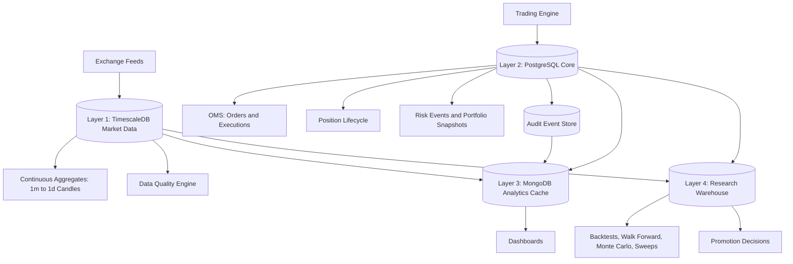
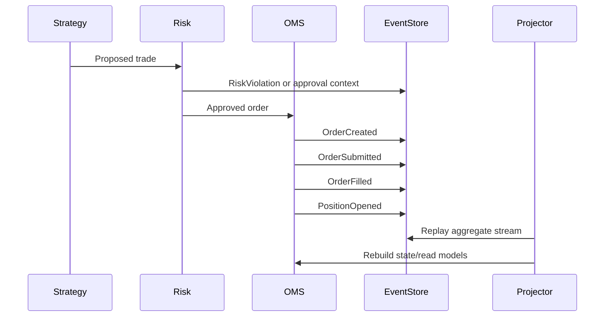
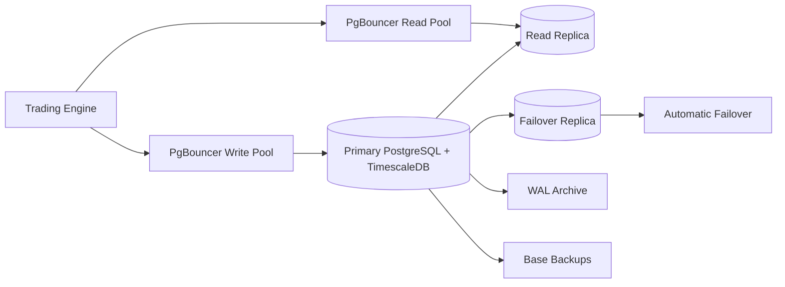

# Phase 7 Database, Persistence, Data Infrastructure & Research Storage Hardening

## Target Architecture

The platform moves from mixed SQLite/Mongo/Supabase persistence into a four-layer architecture with clear ownership boundaries.

Layer ownership:

- TimescaleDB is the market data source of truth for ticks, candles, funding, liquidations, and order books.
- PostgreSQL Core is the trading source of truth for accounts, OMS, positions, risk, portfolio snapshots, promotion history, config, and audit events.
- MongoDB is a cache/read-model layer only for dashboards, leaderboards, summaries, analytics views, AI summaries, and precomputed reports.
- Research Warehouse is isolated from live trading writes and holds multi-year research results.

## Delivered Files

- `client/supabase/migrations/009_institutional_database_foundation.sql`
- `client/supabase/migrations/010_event_replay_data_quality_and_security.sql`
- `infrastructure/database/mongo/analytics-indexes.js`
- `infrastructure/database/pgbouncer/pgbouncer.ini`
- `infrastructure/database/pgbouncer/userlist.example.txt`
- `infrastructure/database/scripts/backup-pitr.sh`
- `infrastructure/database/scripts/restore-pitr.sh`
- `infrastructure/database/scripts/explain-performance.sql`
- `infrastructure/database/monitoring/prometheus-database-alerts.yml`
- `infrastructure/database/monitoring/grafana-database-dashboard.json`

## TimescaleDB Market Engine

Hypertables:

- `market.market_ticks`, chunked daily, retained 180 days.
- `market.market_candles_1m`, `3m`, `5m`, `15m`, `30m`, `1h`, `4h`, `1d`, chunked weekly, retained 5 years.
- `market.funding_rates`, chunked monthly, retained 5 years.
- `market.liquidation_events`, chunked weekly, retained 2 years.
- `market.orderbook_snapshots`, chunked daily, retained 30 days.

Compression:

- Market ticks compress after 30 days.
- Candle hypertables compress after 30 days.
- Funding compresses after 30 days.
- Liquidations compress after 30 days.
- Order book snapshots compress after 7 days because retention is short and raw volume is high.

Continuous aggregates:

- `market.cagg_ticks_1m`
- `market.cagg_ticks_3m`
- `market.cagg_ticks_5m`
- `market.cagg_ticks_15m`
- `market.cagg_ticks_30m`
- `market.cagg_ticks_1h`
- `market.cagg_ticks_4h`
- `market.cagg_ticks_1d`

Refresh policies are real-time oriented for short windows and progressively slower for high timeframes.

## PostgreSQL Core Trading Database

Core normalized entities:

- `core.users`
- `core.accounts`
- `core.strategies`
- `core.strategy_versions`
- `core.strategy_health`
- `core.research_tournaments`
- `core.orders`
- `core.executions`
- `core.positions`
- `core.closed_positions`
- `core.position_events`
- `core.risk_events`
- `core.portfolio_snapshots`
- `core.promotion_history`
- `core.system_config`

Every high-value trading state has a primary key, foreign keys, constraints, and query-path indexes. JSON is avoided except the event payload because event sourcing requires a versioned envelope for heterogeneous events.

## OMS Storage

OMS tables:

- `core.orders` supports order status retrieval under 5ms through `orders_status_created_idx`, `orders_account_status_created_idx`, and order primary key lookups.
- `core.executions` supports 10M+ fills through append-only rows, order/time indexes, and narrow numeric fields.

Execution quality fields:

- Fill price
- Fill quantity
- Fees
- Slippage bps
- Latency ms
- Maker/taker flag
- Exchange execution ID

## Position Storage

Position lifecycle tables:

- `core.positions` stores current lifecycle state.
- `core.closed_positions` stores terminal PnL, fees, funding, duration, and exit reason.
- `core.position_events` records every mark, risk update, scale, funding accrual, and state transition.

This supports reconstruction without relying on a mutable snapshot alone.

## Event Sourcing

Event store:

- `audit.event_store`

Events:

- OrderCreated
- OrderSubmitted
- OrderFilled
- OrderCancelled
- PositionOpened
- PositionClosed
- RiskViolation
- StrategyPromoted
- StrategyDisabled
- KillSwitchTriggered
- CircuitBreakerTriggered
- AITradeApproved
- AITradeRejected

Replay functions:

- `audit.append_event(...)`
- `audit.replay_events(...)`

State reconstruction reads ordered events by aggregate type, aggregate ID, and sequence number.

## AI Audit Database

AI decisions are stored in `audit.ai_decisions`, a Timescale hypertable retained for 90 days.

Stored fields:

- Market state hash
- Bull, bear, macro, and risk veto outputs
- Final decision
- Latency
- Tokens
- Model
- Provider
- Confidence

The table is indexed by symbol/time and provider/model/time and compressed after 7 days.

## Research Warehouse

Research schema:

- `research.backtests`
- `research.walk_forward_results`
- `research.monte_carlo_simulations`
- `research.parameter_sweeps`
- `research.strategy_comparisons`
- `research.optimization_results`

Production trading writes should never share the same write pool as research jobs. In production, deploy the warehouse as either a separate database or a separate PostgreSQL cluster fed by logical replication/read replicas.

## MongoDB Analytics Layer

MongoDB collections:

- `dashboard_metrics`
- `strategy_leaderboards`
- `research_summaries`
- `analytics_views`
- `ai_summaries`
- `precomputed_reports`
- existing `paper_trades`, `logs`, `account_snapshots`

Rules:

- MongoDB is not source of truth.
- All Mongo documents are rebuildable from TimescaleDB/PostgreSQL/Research Warehouse.
- Dashboard caches use TTL indexes: 30 days for volatile dashboard/log views, 90 days for summaries and reports.

## Data Quality Engine

SQL function:

- `ops.run_market_data_quality_check(symbol, start, end)`

Detects:

- Missing 1m candles from tick-derived continuous aggregates
- Duplicate ticks by exchange/symbol/trade ID
- Timestamp drift between exchange time and receive time
- Bad prices and bad quantities
- Exchange outage windows

Outputs:

- `ops.data_quality_checks`
- `ops.data_repair_jobs`
- `ops.data_quality_latest`

Repair jobs are intentionally queued instead of blindly mutating data. Production repair workers should backfill from exchange archives, verify hashes, and then rerun the quality check.

## Retention Policy

- Raw ticks: 180 days
- Order books: 30 days
- AI logs: 90 days
- Application logs in MongoDB: 30 days
- Candles: 5 years
- Funding: 5 years
- Liquidations: 2 years
- Trades: permanent
- Research: permanent
- Audit events: permanent
- Portfolio snapshots: 10 years

Cleanup is enforced by Timescale retention policies and Mongo TTL indexes. Permanent records are never TTL-deleted.

## High Availability

HA requirements:

- Primary PostgreSQL/TimescaleDB for writes.
- Read replica for dashboards and analytics reads.
- Failover replica for automatic promotion.
- PgBouncer separates read and write pools.
- WAL archiving plus base backups enable PITR.
- MongoDB should run as a replica set because it serves dashboards, but it is rebuildable.

## Backup And Disaster Recovery

Scripts:

- `backup-pitr.sh` creates physical base backups and logical dumps.
- `restore-pitr.sh` prepares recovery to a target timestamp.

Schedule:

- WAL archiving continuously.
- Incremental/WAL backup target every 15 minutes or faster.
- Full base backup daily.
- Retention 30 days.

Recovery procedure:

1. Stop writes and freeze deployment.
2. Select the latest base backup before the target recovery time.
3. Restore the base backup into a clean data directory.
4. Configure `restore_command` and `recovery_target_time`.
5. Start PostgreSQL and let WAL replay complete.
6. Promote recovered instance.
7. Run data quality checks for market data and portfolio snapshots.
8. Rebuild Mongo analytics caches from source-of-truth stores.

## Performance Targets

- Order lookup: less than 5ms.
- Position lookup: less than 5ms.
- Strategy health query: less than 10ms.
- Portfolio snapshot query: less than 10ms.
- Research query: less than 100ms.
- Dashboard load: less than 500ms with MongoDB read models.

Validation:

- Use `infrastructure/database/scripts/explain-performance.sql` on staging with representative data.
- Watch buffer reads, sequential scans, sort spills, row estimates, and chunk exclusion.
- Any trading-path query missing an index is a release blocker.

## Connection Pooling

PgBouncer config:

- Write pool routes to primary.
- Read pool routes to read replica.
- Research read pool routes to research database.
- Transaction pooling avoids connection storms.
- TLS required for client and server connections.
- Waiting clients alert immediately because order latency is trading-critical.

## Security

Controls:

- TLS everywhere.
- Separate roles for writer, reader, analytics reader, and research writer.
- No dashboard user gets write access to trading tables.
- Event append function is security-definer controlled.
- Credentials are rendered from a secrets manager into PgBouncer and app environments.
- Rotate credentials on a fixed schedule and immediately after incident response.
- Audit events are permanent.

## Storage Growth Model

Assumptions:

- BTC tick feed averages 20 ticks per second per exchange.
- Order book snapshots every 500ms.
- One primary BTC perpetual symbol initially, designed for multi-symbol scaling.
- Compression reduces Timescale old chunks by roughly 70-90% depending on cardinality.

One-year sizing:

- Ticks: roughly 630M raw rows per symbol/exchange before 180-day retention; retained hot set about 310M rows.
- Order books: roughly 63M snapshots per symbol/exchange with 30-day retention.
- Candles/funding/liquidations: small compared with ticks and order books.
- Orders/executions/trades: well below market data volume; indexes dominate for executions at 10M+ scale.
- Research warehouse: depends on backtest sweeps; keep on separate storage class from live trading.

Three-year sizing:

- Candles, funding, audit, trades, and research become the dominant retained history.
- Ticks remain bounded by retention.
- Research warehouse should move older parameter sweeps to cheaper storage or separate analytical warehouse replicas.

Five-year sizing:

- Candle/funding history remains queryable in Timescale.
- Research warehouse requires partitioning by creation time and strategy version.
- Permanent audit/event data should be archived to object storage snapshots while remaining queryable in PostgreSQL for recent operational windows.

Infrastructure recommendation:

- Start with dedicated PostgreSQL/TimescaleDB primary plus read replica.
- Use NVMe-backed storage for primary hot writes.
- Keep research on a separate database or separate cluster before enabling broad parameter sweeps.
- Use object storage for WAL, base backups, and cold research exports.

Cost guidance:

- Highest cost drivers are order book snapshots and tick writes.
- Compression and retention are mandatory to keep storage bounded.
- MongoDB should stay small because it only stores TTL-cached read models.
- Research warehouse costs scale with tournament and optimization volume, not live trading.

## Final Readiness Score

Database score improves from approximately 4/10 to 8.5/10+ after applying these migrations and operational assets because the platform gains:

- A market-data source of truth with Timescale hypertables.
- Normalized trading source-of-truth storage.
- Event sourcing and replay.
- Compressed/retained AI audit logs.
- Isolated research warehouse.
- MongoDB cache-only read models.
- Indexes for trading, dashboard, and research query paths.
- Data quality checks and repair queues.
- PgBouncer pooling.
- HA, backup, monitoring, and security runbooks.

Remaining deployment work is operational rather than architectural: provision the managed PostgreSQL/TimescaleDB cluster, enable backup/WAL infrastructure, apply migrations in staging, load representative data, run EXPLAIN plans, and connect the application writers/readers to their new roles.
