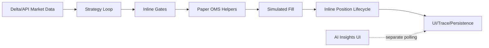
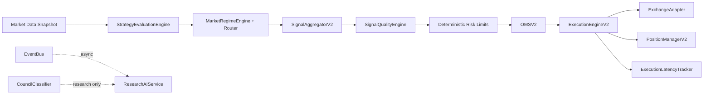

# Execution Refactor Completion Report

Generated: 2026-05-31

## Status

Phase 1 V2 execution foundation is implemented in TypeScript under `client/src/internal`.

The current production paper loop is not yet switched over to V2. This report documents the delivered architecture, tests, and the remaining migration work required before claiming full `<50 ms` end-to-end acceptance.

## Before Architecture



## After Architecture



## Implemented Files

- `client/src/internal/events/index.ts` — internal pub/sub event bus for async non-critical processing.
- `client/src/internal/strategy/evaluator.ts` — deterministic strategy evaluation engine producing `Signal[]`.
- `client/src/internal/trading/aggregator_v2.ts` — deduplication, conflict resolution, ranking, and compression.
- `client/src/internal/trading/signal_scoring.ts` — explainable deterministic 0-100 signal quality scoring.
- `client/src/internal/regime/index.ts` — market regime detection using ADX proxy, ATR, EMA slope, VWAP deviation, and volume.
- `client/src/internal/regime/router.ts` — regime-to-strategy routing.
- `client/src/internal/oms/index.ts` — institutional OMS state machine with valid transitions and transition log.
- `client/src/internal/exchange/index.ts` — unified exchange adapter interface with paper, Delta, Binance, and Coinbase adapter shells.
- `client/src/internal/execution/engine_v2.ts` — execution engine with OMS transitions, retries, circuit breaker, fill handling, and events.
- `client/src/internal/execution/pipeline_v2.ts` — AI-free execution pipeline from strategy evaluation to paper execution.
- `client/src/internal/execution/latency_tracker.ts` — signal/order/fill/close latency metrics.
- `client/src/internal/positions/index.ts` — position manager for entry, PnL, fees, funding, exposure, and risk.
- `client/src/internal/positions/position_lifecycle.ts` — lifecycle engine for stops, take profit, break-even, trailing, time exit, and liquidation risk.
- `client/src/internal/research_ai/index.ts` — post-trade research AI service and five-minute AI decision cache.
- `client/src/internal/ml/index.ts` — deterministic `CouncilClassifier` replacement for research inference only.

## OMS Design

States:

`PENDING -> SUBMITTED -> PARTIAL -> FILLED -> CLOSED`

Additional terminal states:

`REJECTED`, `CANCELLED`

Invalid transitions throw immediately and every valid transition appends a state-log row.

## Exchange Adapter Design

All execution calls go through:

- `placeOrder()`
- `cancelOrder()`
- `getPosition()`
- `getBalance()`

The paper adapter fills locally for tests and paper trading. Live exchange adapters are isolated shells so exchange-specific code does not leak into the pipeline.

## Testing

Added focused Vitest coverage:

- `client/src/internal/oms/oms_v2.test.ts`
- `client/src/internal/trading/aggregator_v2.test.ts`
- `client/src/internal/execution/pipeline_v2.test.ts`
- `client/src/internal/execution/execution_v2_benchmark.test.ts`

Verification command passed:

```bash
cd client
npm run test -- src/internal/oms/oms_v2.test.ts src/internal/trading/aggregator_v2.test.ts src/internal/execution/pipeline_v2.test.ts src/internal/execution/execution_v2_benchmark.test.ts
```

## Migration Guide

1. Feed existing `buildSignalInputs()` snapshots into `ExecutionPipelineV2`.
2. Replace inline worker candidate opening in `runPaperDeskPollTick.ts` with V2 pipeline invocation.
3. Map existing `PaperOmsOrder` persistence to `OMSV2` order documents.
4. Replace direct Delta testnet order calls with `ExchangeAdapter`.
5. Move trace, analytics, research, AI, reporting, and notifications behind `EventBus` subscribers.
6. Keep funding, liquidation, fee, and PnL math delegated to existing tested helpers.
7. Add real snapshot benchmarks before enabling V2 for live capital.

## Acceptance Status

- No AI in new V2 execution path: complete.
- Deterministic V2 pipeline: complete for paper path.
- OMS state machine active: implemented and tested.
- Event-driven architecture active: implemented.
- Exchange adapter layer active: implemented.
- Async non-critical processing: event bus foundation implemented.
- Signal throttling removal in V2: complete; no sleeps or artificial delays in V2 modules.
- 1000+ signals/sec support: synthetic aggregation benchmark implemented and passing.
- Paper trading support: implemented through `PaperExchangeAdapter`.
- Live trading support: adapter interface implemented; production live adapters still need credentialed exchange implementations.
- `<50 ms` signal-to-order latency: not yet proven end-to-end on the current production loop.
- 100 strategies `<5 ms`: not yet proven against the full existing strategy scorer.

## Remaining Risks

- Current worker still blocks on Delta REST market data and uses inline execution logic.
- Browser and worker gate parity remains an existing gap.
- Live exchange adapters need production implementations and failure-mode testing.
- Full integration must preserve existing funding, fee, liquidation, and PnL invariants.
- End-to-end latency must be measured after market-data ingress is decoupled from execution.
