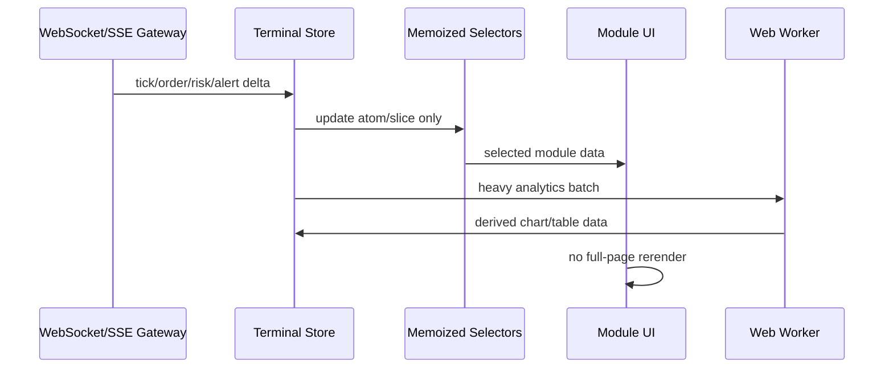
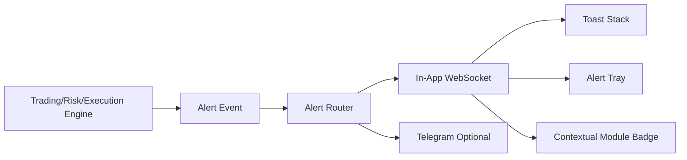

# Institutional BTC Trading Terminal UI/UX Blueprint

## Objective

Redesign the current BTC dashboard into a hedge-fund-grade terminal optimized for execution decisions in under 2 seconds, continuous risk visibility, research workflows, analytics, and professional journaling.

The existing UI already has reusable desk primitives (`DeskCard`, `DeskDataTable`, `DeskMetricTile`, `DeskShell`) and an early `terminal/` grid system. The redesign should preserve those primitives but move from a single strategy-heavy dashboard into four independently loaded terminal modules:

- `/execution`
- `/risk`
- `/research`
- `/analytics`

## Design Principles

- Speed of decision beats decoration.
- Primary information is always visible: price, PnL, exposure, positions, heat, alerts.
- Secondary information is collapsible, searchable, and virtualized.
- Scalping layout must answer three questions immediately: Can I trade? Where is risk? What changed?
- Dark mode is default. Accent colors are reserved for PnL, side, severity, and status.
- No full-page refresh on ticks. Price, chart, DOM, PnL, and alerts update through a shared real-time data layer.

## Information Architecture

```mermaid
flowchart TB
  Terminal[Institutional BTC Terminal Shell]
  Terminal --> Execution[/execution · Execution Center]
  Terminal --> Risk[/risk · Institutional Risk]
  Terminal --> Research[/research · Strategy Research]
  Terminal --> Analytics[/analytics · Analytics Center]
  Terminal --> Journal[/journal · Trade Journal]

  Execution --> Chart[TradingView-Level Chart]
  Execution --> DOM[Order Book / DOM Ladder]
  Execution --> Positions[Open Positions + Live PnL]
  Execution --> QuickTrade[Quick Trade + Hotkeys]
  Execution --> Portfolio[Portfolio Summary]

  Risk --> Var[VaR / CVaR]
  Risk --> Heat[Portfolio Heat]
  Risk --> Corr[Correlation Heatmap]
  Risk --> Funding[Funding Exposure]
  Risk --> Drawdown[Drawdown Tracker]

  Research --> Leaderboard[Strategy Leaderboard]
  Research --> Tournament[Research Tournament]
  Research --> WalkForward[Walk Forward]
  Research --> Promotion[Promotion / Demotion]

  Analytics --> Equity[Equity vs BTC Benchmark]
  Analytics --> Rolling[Rolling Sharpe / PF]
  Analytics --> Fees[Fee Drag]
  Analytics --> Distribution[R-Multiple Distribution]
```

## Terminal Shell

The shell owns navigation, global hotkeys, WebSocket lifecycle, alert tray, account selector, module code splitting, and shared state subscriptions.

Recommended route structure:

```text
client/src/app/terminal/
  layout.tsx
  execution/page.tsx
  risk/page.tsx
  research/page.tsx
  analytics/page.tsx
  journal/page.tsx

client/src/components/terminal/
  TerminalShell.tsx
  TerminalTopBar.tsx
  TerminalSidebar.tsx
  TerminalStatusStrip.tsx
  TerminalPanel.tsx
  TerminalWorkspace.tsx

client/src/components/terminal/execution/
  ExecutionCenter.tsx
  BtcExecutionChart.tsx
  OrderBookDepth.tsx
  DomLadder.tsx
  QuickTradePanel.tsx
  OpenPositionsBlotter.tsx
  PortfolioSummaryStrip.tsx

client/src/components/terminal/risk/
  InstitutionalRiskModule.tsx
  VarCvarPanel.tsx
  PortfolioHeatGauge.tsx
  CorrelationHeatmap.tsx
  KellySizingMatrix.tsx
  FundingExposurePanel.tsx
  ExposureBreakdown.tsx

client/src/components/terminal/research/
  StrategyResearchCenter.tsx
  StrategyLeaderboardGrid.tsx
  ResearchTournamentBoard.tsx
  WalkForwardMatrix.tsx
  StrategyComparisonChart.tsx
  PromotionTimeline.tsx

client/src/components/terminal/analytics/
  AnalyticsCenter.tsx
  BenchmarkEquityOverlay.tsx
  RollingSharpePanel.tsx
  ProfitFactorTrend.tsx
  FeeDragPanel.tsx
  TradeDistributionPanel.tsx

client/src/components/terminal/journal/
  TradeJournalPro.tsx
  TradeReplayDrawer.tsx
  TradeMetadataPanel.tsx
  JournalFilters.tsx
  JournalExportButton.tsx

client/src/lib/terminal/
  terminalStore.ts
  terminalTypes.ts
  terminalSelectors.ts
  terminalSocket.ts
  alertBus.ts
  hotkeys.ts
  chartOverlays.ts
```

## Execution Center Wireframe

Desktop layout uses a 12-column dense grid:

```text
┌───────────────────────────────────────────────────────────────────────────────┐
│ Top Bar: BTC-PERP price · spread · funding · regime · heat · alert severity │
├───────────────┬───────────────────────────────────────┬──────────────────────┤
│ Watch / DOM   │ Chart: candles + VP + liq + positions │ Quick Trade          │
│ Order book    │                                       │ Buy / Sell / Close   │
│ Depth ladder  │                                       │ Size, leverage, SLTP │
│ Imbalance     │                                       │ Hotkeys, confirm     │
├───────────────┴───────────────────────────────────────┼──────────────────────┤
│ Open Positions Blotter: live PnL, liq, funding, risk  │ Portfolio Summary    │
├───────────────────────────────────────────────────────┴──────────────────────┤
│ Alerts + Execution Tape + Recent Fills                                       │
└───────────────────────────────────────────────────────────────────────────────┘
```

Decision-critical elements stay above the fold:

- Price and spread.
- Chart with position, liquidation, and risk lines.
- DOM ladder and order book imbalance.
- Open positions and live PnL.
- Portfolio heat and margin usage.
- Quick trade controls.

## Risk Dashboard

Risk is not a report page; it is a live command module.

Required panels:

- VaR 95% and 99% in USD and account %.
- CVaR / expected shortfall.
- Portfolio heat meter with color bands: normal, reduce, block, force-reduce.
- Correlation heatmap by strategy and family.
- Kelly recommendation per active strategy.
- Real-time drawdown and recovery tracker.
- Long/short, gross/net, family, regime, and strategy exposure.
- Funding paid/received, funding drag, funding risk per open position.

Risk module layout:

```text
Top: heat · VaR · CVaR · drawdown · leverage
Middle: correlation heatmap · exposure breakdown · family heat
Bottom: Kelly matrix · funding exposure · risk alerts
```

## Research Center

The research center separates strategy discovery from live execution.

Required workflows:

- Rank strategies by Sharpe, expectancy, drawdown, OOS PF, robustness, and benchmark alpha.
- Show ACTIVE / WATCHLIST / DISABLED state with reason and latest health update.
- Research tournament board with winners, retired strategies, and promotion gates.
- Walk-forward matrix showing IS vs OOS degradation.
- Strategy comparison chart with equity curve overlays.
- Promotion/demotion visualization with audit history and operator notes.

Large tables must be virtualized. Research tables should not re-render on tick updates.

## Analytics Center

Analytics answers portfolio quality questions:

- Is the desk beating BTC buy-and-hold?
- Is edge improving or decaying?
- Are fees/funding eating expectancy?
- Which families contribute returns and risk?
- Are wins/losses behaving as expected in R-multiple space?

Required panels:

- Equity curve vs BTC benchmark overlay.
- Rolling Sharpe 30D / 90D.
- Profit factor trend.
- Win rate distribution.
- Fee drag and funding drag.
- Trade breakdown by family.
- R-multiple distribution.

## Trade Journal Pro

Every trade row opens a replay drawer:

- Chart centered at entry time.
- Entry signal stack and score breakdown.
- Strategy, setup tag, regime, confidence, and risk score.
- R-multiple, MFE, MAE, holding time, exit reason.
- Funding paid/received and fee drag.
- Replay controls: entry, peak, exit.
- Export selected trades to CSV.

Filters:

- Strategy.
- Family.
- Setup tag.
- Win/loss.
- Time of day/session.
- Regime.
- Exit reason.

## Charting Strategy

Current `InstitutionalChart` uses `lightweight-charts`, which is a good production base. Upgrade it into a composable chart system:

```text
BtcExecutionChart
  ├─ CandleSeries
  ├─ VolumeSeries
  ├─ VolumeProfileOverlay
  ├─ VPOC / HVN / LVN Lines
  ├─ LiquidityLevelsOverlay
  ├─ FundingRatePane
  ├─ LiquidationLevelsOverlay
  ├─ PositionLinesOverlay
  ├─ OrderBlockZonesOverlay
  ├─ MTFLevelsOverlay
  └─ TradeMarkersOverlay
```

Recommendation:

- Keep `lightweight-charts` for execution speed and full React control.
- Add TradingView widget only as an optional analyst mode if external scripts and licensing are acceptable.
- For volume profile, compute bins server-side or in a Web Worker, then render as custom price-scale overlays.
- For liquidation heatmap, render precomputed liquidation levels as horizontal bands rather than dense canvas heatmaps on every tick.

## Data Flow



Shared socket channels:

- `market.tick`
- `market.candle`
- `orderbook.snapshot`
- `position.updated`
- `trade.closed`
- `risk.snapshot`
- `strategy.health`
- `research.update`
- `alert.created`
- `execution.fill`

State model:

- One central lightweight store with slice subscriptions.
- Avoid one giant object passed into all panels.
- Use stable selectors for `price`, `positions`, `risk`, `alerts`, `strategyTable`, and `chartOverlays`.
- Tick updates should touch only chart, price strip, DOM, and live PnL selectors.

## Notification Architecture

Alert pipeline:



Severity:

- INFO: new trade opened, strategy promoted, normal funding update.
- WARNING: funding spike, drawdown threshold, strategy disabled, high spread.
- CRITICAL: SL hit, kill switch, VaR breach, circuit breaker, liquidation risk.

UX rules:

- Critical alerts persist until acknowledged.
- Warning alerts auto-collapse into alert tray after 8-12 seconds.
- Info alerts are quiet by default and visible in execution tape.
- Alert tray supports filtering by severity/module.

## Mobile Responsiveness

Mobile mode is not the full terminal compressed onto a small screen. It is a scalping cockpit:

Primary bottom tabs:

- Chart.
- Positions.
- Trade.
- Alerts.

Mobile layout:

```text
Top: BTC price · PnL · heat
Tab 1: chart with position/liquidation lines
Tab 2: open positions, close buttons, live PnL
Tab 3: quick buy/sell/close, size presets, SL/TP
Tab 4: alerts and risk status
```

Touch rules:

- Buy/Sell/Close buttons require thumb-safe hit targets.
- Destructive actions use hold-to-confirm or two-step confirmation.
- DOM ladder becomes compact depth imbalance, not a full desktop ladder.
- Research and analytics are read-only summaries on mobile.

## Component Optimization Strategy

- Virtualize all tables over 100 rows: strategies, trades, orders, alerts, fills.
- Use `React.memo` for panels that subscribe to stable store slices.
- Use `useMemo` for table column definitions and derived chart overlays.
- Use `useCallback` only for callbacks passed to memoized children or hot controls.
- Move Monte Carlo, volume profile, liquidation heatmap, equity-curve comparisons, and strategy comparison calculations into Web Workers.
- Use dynamic imports for each terminal module.
- Use WebSocket/SSE deltas instead of polling for terminal pages.
- Keep chart updates imperative via chart refs; do not push every tick through React rendering.

## Web Worker Plan

Workers:

- `analytics.worker.ts`: rolling Sharpe, PF trends, distributions.
- `chart-overlays.worker.ts`: volume profile, VPOC/HVN/LVN, liquidation bands.
- `research.worker.ts`: strategy comparison, walk-forward matrix formatting.
- `replay.worker.ts`: trade replay slices and signal timelines.

Worker messages should use typed payloads and transferable arrays where possible.

## Design System

Dark mode first:

- Background: deep neutral surfaces.
- Text: high contrast for primary numbers, muted for labels.
- Profit: controlled green.
- Loss/critical: controlled red.
- Warning/funding risk: amber.
- Info/active: blue.

Typography:

- Price, PnL, and risk values use mono numerals.
- Labels are compact uppercase.
- Avoid long prose inside live trading panels.

Hierarchy:

- Level 1: price, PnL, positions, heat, alerts, order controls.
- Level 2: strategy stats, analytics, research, journal metadata.

## Implementation Roadmap

1. Add terminal routes and module shell.
2. Introduce shared terminal store and WebSocket gateway.
3. Replace polling panels in terminal routes with socket-fed read models.
4. Build Execution Center with chart, DOM, positions, quick trade, and alerts.
5. Integrate `InstitutionalRiskCenter` into `/risk`.
6. Move research panels into `/research` with virtualization.
7. Build analytics module with benchmark overlays and worker-backed calculations.
8. Upgrade trade journal with replay drawer and CSV export.
9. Add mobile cockpit tabs.
10. Add performance budgets to CI: render frame, table virtualization, socket processing, chart update latency.

## Acceptance Criteria

- Execution Center supports a scalping decision in under 2 seconds.
- Price/chart/PnL updates have perceived latency below 100ms.
- Strategy table handles 100+ strategies without frame drops.
- No tick update triggers full terminal rerender.
- Risk heat, VaR/CVaR, funding exposure, and alerts are always visible or one click away.
- Research is isolated from live trading UI state.
- Trade replay is available from every closed trade.
- Mobile mode supports chart, positions, quick trade, and alerts.
