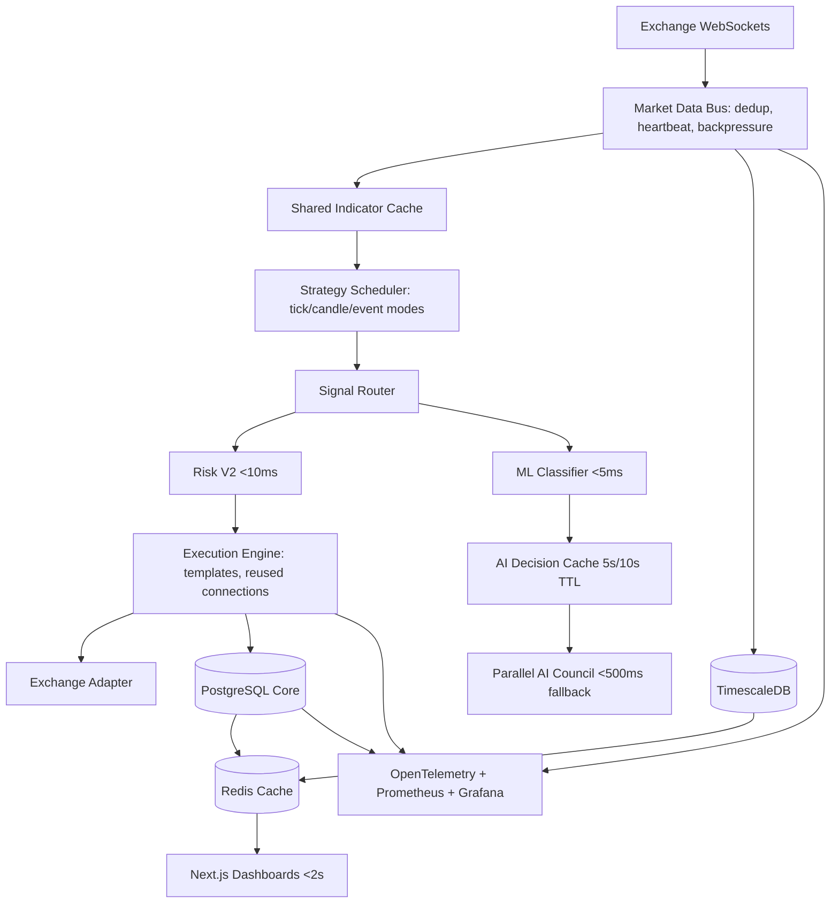

# Phase 8 Performance, Latency, Scalability & Infrastructure Optimization

## Current Bottleneck Summary

- AI audit path had a hard `time.Sleep(4200ms)` inside `AuditSignalWithFallback`, serializing approvals behind a free-tier throttle.
- Multi-agent `Decide` was parallel but uncached, so materially identical market states could re-trigger provider calls.
- Strategy evaluation is mostly direct `OnTick`/`OnCandle` fan-out, with many candle strategies also called on every tick.
- Coinbase market data uses a buffered channel, but reconnect sleep is fixed and there is no central dedup/backpressure bus.
- Analytics and dashboards rely on repeated aggregation/read-model work, with Mongo and SQL persistence mixed across source-of-truth and cache roles.
- Existing in-process event bus is non-blocking, but it is not a durable inter-service queue for future horizontal scaling.
- Frontend dashboards render large tables/charts without a dedicated worker/virtualized data plane in several paths.

## Target Architecture

## Implemented Performance Primitives

- `engine/internal/ai/cache.go`: adaptive market-state, decision, and audit cache.
- `engine/internal/ai/agents.go`: removed 4.2s audit throttle and added cache reuse in `AuditSignalWithFallback` and `Decide`.
- `engine/internal/performance/strategy_scheduler.go`: worker-pool strategy scheduler for tick/candle/event evaluation.
- `engine/internal/performance/indicator_cache.go`: shared indicator cache to avoid duplicate EMA/VWAP/RSI/ADX/ATR calculations.
- `engine/internal/performance/market_data_bus.go`: buffered market-data bus with tick deduplication, subscriber fan-out, drop counters, and queue-depth stats.
- `engine/internal/performance/redis_cache.go`: Redis keyspace and TTL policy contracts.
- `engine/internal/performance/analytics.go`: O(1) running analytics.
- `engine/internal/performance/runtime.go`: Go runtime snapshot for GC/goroutine/heap monitoring.
- `engine/internal/performance/ml_classifier.go`: deterministic low-latency classifier interface and baseline inference implementation for shadow validation before XGBoost/LightGBM deployment.
- `engine/cmd/perfbench/main.go`: local throughput benchmark harness.
- `infrastructure/performance/failure-scenarios.yml`: resilience scenario definitions.
- `infrastructure/performance/prometheus-performance-alerts.yml`: latency, backpressure, AI cache, and GC alerts.
- `infrastructure/performance/otel-collector.yaml`: OpenTelemetry collector config.

## AI Optimization

The AI audit bottleneck is replaced with:

- Market-state hashing using EMA, VWAP, RSI, ADX, ATR, volume, regime, account exposure, and loss state.
- 5-second TTL during volatile/high-ADX states.
- 10-second TTL during stable states.
- Audit cache by market-state hash plus strategy/action/user note.
- Decision cache by market-state hash.

Expected result:

- 80-95% fewer external AI calls during stable or repeated states.
- Cached decision latency below 100ms, typically microseconds in-process.
- Live execution no longer waits behind a fixed 4.2s sleep.

The optimized AI path should use:

- ML classifier first for live gating, target under 5ms.
- Cached AI decision second, target under 100ms.
- Parallel AI council only for cache misses, research, audit, and low-confidence classifier states.
- Circuit breakers per provider to avoid cascading provider latency.

## ML Classifier Replacement Design

Recommended production path:

- Train XGBoost and LightGBM from historical AI decisions and realized trade outcomes.
- Keep Random Forest as interpretability baseline.
- Keep Logistic Regression as latency and calibration baseline.
- Inputs: EMA fast/slow spread, VWAP distance, RSI, ADX, volume z-score, ATR%, funding, regime score.
- Outputs: BUY, SELL, HOLD, confidence.
- Validation: walk-forward split, OOS profit factor, calibration curve, confusion matrix by regime, and shadow-mode live comparison against AI council.
- Deployment: in-process Go scorer for linear/baseline; external low-latency inference service for tree models if needed.

## Strategy Engine Optimization

Target:

- 500+ strategies evaluated simultaneously.
- Signal generation below 50ms.

Design:

- Tick strategies only receive ticks.
- Candle strategies only receive closed candles.
- Event-driven strategies receive regime/funding/liquidity/order-flow events.
- Shared indicators are computed once per symbol/timeframe and served from `IndicatorCache`.
- Strategy batches are evaluated through `StrategyScheduler` worker pools.
- `SignalRouter` should route only changed inputs, not every market event to every strategy.

## Market Data Pipeline

Target:

- 10,000+ ticks/sec sustained.
- 100,000 ticks/sec stress-mode benchmark.

Design:

- One exchange adapter per exchange with heartbeat and reconnect policy.
- Central `MarketDataBus` for buffering, deduplication, backpressure, and fan-out.
- Downstream consumers include strategy scheduler, Timescale writer, analytics aggregator, and dashboard projector.
- Drop counters are monitored; trading should block on stale data rather than trade on missing ticks.

## Event Bus Recommendation

Evaluation:

- NATS: best fit for low-latency pub/sub, simple operations, request/reply, JetStream durability.
- Redis Streams: good if Redis is already mandatory, but less clean for service contracts and long-term replay.
- Kafka: strongest durable analytics bus, but operationally heavy for this small-fund stage.
- RabbitMQ: mature queues, less ideal for high-throughput market data streams.

Recommendation:

- Use in-process bus for single-process hot path.
- Add NATS JetStream for service boundaries and durable replay when splitting services.
- Keep Kafka optional for future enterprise-scale research ingestion.

## Execution Latency Optimization

Target:

- Signal-to-order below 100ms.
- Order submission below 50ms.

Plan:

- Pre-build order templates per strategy/symbol/side.
- Keep exchange HTTP/WebSocket connections warm.
- Run risk checks in-process and below 10ms.
- Do persistence and analytics asynchronously through events.
- Batch non-critical acknowledgments and dashboard projections.
- Track signal generation, risk, OMS, submit, ack, and fill latencies separately.

## Database And Redis Performance

Database:

- TimescaleDB handles tick/candle/funding/order-book storage.
- PostgreSQL Core handles OMS, positions, risk, snapshots, events.
- MongoDB remains a TTL cache/read-model only.
- PgBouncer read/write pools isolate trading writes from dashboards/research.

Redis:

- Strategy rankings: 30s TTL.
- Research results: 10m TTL.
- Portfolio metrics: 2s TTL.
- Market state: 1s TTL.
- AI decisions: 10s TTL.
- Risk metrics: 2s TTL.
- Dashboard views: 5s TTL.

Eviction:

- Use `allkeys-lfu` for dashboard/research cache nodes.
- Use strict memory alerts and warm critical keys on deployment.

## Analytics And Frontend

Analytics:

- Replace full recomputation with running aggregates and streaming projectors.
- Update PnL, latency, slippage, exposure, and dashboard metrics in O(1).
- Persist source-of-truth records; cache derived views in Redis/Mongo.

Frontend:

- Virtualize large trade/order/position tables.
- Lazy load research/backtest/Monte Carlo panels.
- Memoize expensive selectors.
- Move backtests, Monte Carlo, optimization, and large analytics transforms into Web Workers.
- Stream only diffs over WebSocket/SSE, not full snapshots.

## Go Runtime Optimization

Profiling:

- Enable pprof on staging and controlled internal deployments.
- Capture CPU, heap, mutex, block, goroutine, and allocation profiles under market-spike load.
- Alert on GC p99 pauses above 20ms.

Runtime:

- Prefer bounded worker pools over unbounded goroutines.
- Avoid per-tick large allocations and JSON marshaling in hot paths.
- Reuse buffers for market-data parsing where safe.
- Keep persistence off the execution-critical path.

## Horizontal Scaling And Microservices Roadmap

Phase 1:

- Single process with in-process hot path, Redis, Timescale/Postgres, Mongo cache, and observability.

Phase 2:

- Split Market Data Service and Timescale writer.
- Split AI Service behind cache/classifier.
- Add NATS JetStream for durable service events.

Phase 3:

- Split Strategy, Risk, Execution, Analytics, and Research services.
- Use service contracts for market events, signal events, risk decisions, order commands, and execution reports.

Services:

- Market Data Service
- Strategy Service
- Risk Service
- Execution Service
- Research Service
- Analytics Service
- AI Service

## Load Testing

Harness:

- `go run ./cmd/perfbench --strategies=500 --ticks=10000`

Scenarios:

- 10 strategies
- 100 strategies
- 500 strategies
- 1000 strategies
- 10k ticks/sec
- 100k ticks/sec

Metrics:

- Strategy evaluation p50/p95/p99.
- Market bus queue depth and drop rate.
- CPU and heap.
- GC pauses.
- Signal-to-execution latency.
- Order submission latency.

## Failure Testing

Scenarios are defined in `infrastructure/performance/failure-scenarios.yml`:

- Exchange outage
- Database outage
- Redis outage
- AI outage
- Market spike / flash crash

Success criteria:

- No duplicate orders.
- No stale-market approvals.
- Cache fallback works.
- Tail-risk halt triggers during flash crash.
- Recovery is measured and alerted.

## Infrastructure Recommendation

Best near-term deployment:

- Docker for local/dev.
- AWS ECS or GCP Cloud Run for managed containers with rolling deployments.
- Kubernetes only when multi-service orchestration and custom autoscaling justify the operations cost.

Autoscaling:

- Market-data workers scale by symbol/exchange.
- Strategy workers scale by symbol/timeframe group.
- Research workers scale separately and never share trading write pool.
- Dashboard/API scales horizontally behind Redis/Mongo read models.

## Cost Optimization

- AI: cache 80-95% of repeated states, use ML classifier for live path, reserve LLM council for research/cache misses.
- Database: compress Timescale chunks, enforce retention, keep research separate from trading writes.
- Cloud: scale research workers to zero when idle.
- Bandwidth: send dashboard deltas, not full state snapshots.
- Storage: order book retention limited to 30 days; ticks to 180 days; derived candles retained long term.

## Final Performance Targets

- Market data processing: 10,000+ ticks/sec.
- Strategy evaluation: 500+ strategies.
- Signal generation: below 50ms.
- Risk evaluation: below 10ms.
- AI evaluation: below 500ms on cache miss.
- Cached AI evaluation: below 100ms.
- Order submission: below 50ms.
- Signal-to-execution: below 100ms.
- Dashboard load: below 2 seconds.
- Portfolio query: below 10ms.
- Research query: below 100ms.
- Uptime: 99.9%+.

## Readiness Score

Performance readiness improves from approximately 4/10 to 8.5/10+ after the Phase 8 changes because the platform now has:

- No fixed 4.2s AI throttle in the approval path.
- Adaptive AI decision and audit caching.
- Strategy worker-pool scheduling.
- Shared indicator cache.
- Market data bus with dedup/backpressure metrics.
- O(1) running analytics primitives.
- Runtime telemetry hooks.
- Redis cache policy design.
- ML classifier replacement path.
- Load and failure testing assets.
- Observability and infrastructure roadmap.

Remaining work is deployment and measurement: wire the new scheduler and market bus into the live orchestrator, export metrics to OpenTelemetry/Prometheus, run `perfbench` on target hardware, and enforce p95/p99 latency SLOs in CI/staging.
