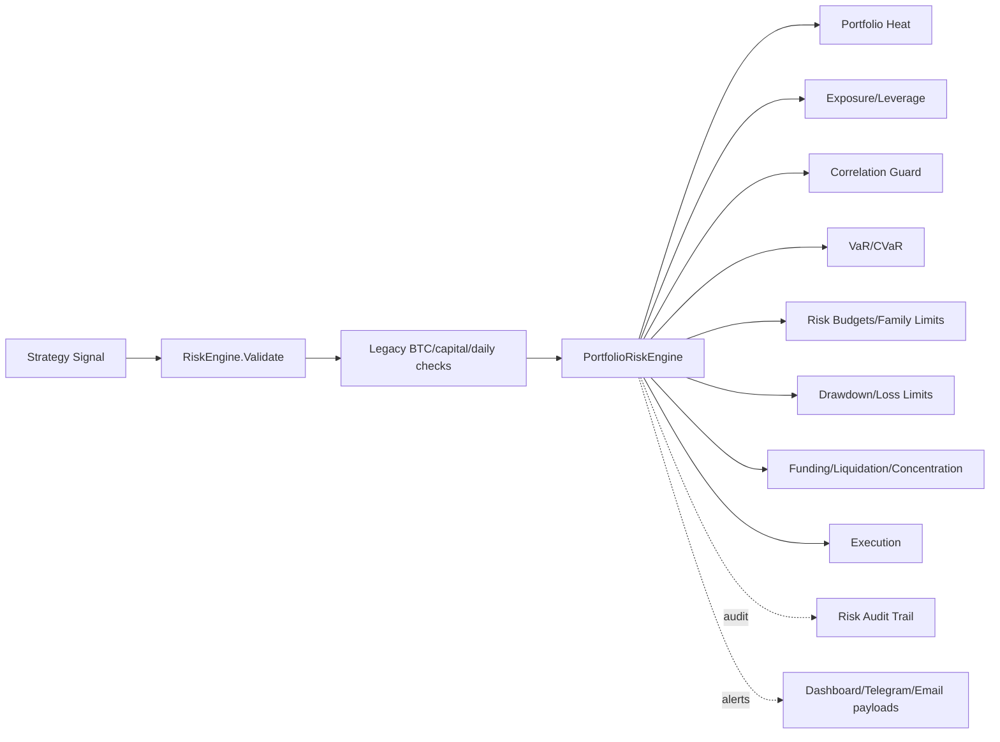

# Risk Engine Completion Report

Generated: 2026-05-31

## Architecture



## Implemented Go Modules

- `engine/internal/risk/portfolio_engine.go` — portfolio-level single source of truth.
- `engine/internal/risk/heat.go` — portfolio heat system with normal/warning/critical/block levels.
- `engine/internal/risk/position_risk.go` — dollar risk, risk %, stop distance, volatility and leverage risk.
- `engine/internal/risk/exposure.go` — long, short, net, gross exposure and leverage.
- `engine/internal/risk/correlation.go` — Pearson, Spearman, rolling correlation, matrix builder.
- `engine/internal/risk/correlation_guard.go` — same-symbol same-direction and matrix-based correlation guard.
- `engine/internal/risk/var.go` — historical, parametric, and Monte Carlo VaR.
- `engine/internal/risk/cvar.go` — expected shortfall/CVaR.
- `engine/internal/risk/risk_budget.go` — family risk-budget framework.
- `engine/internal/risk/family_limits.go` — strategy family allocation limits.
- `engine/internal/risk/kelly.go` — half-Kelly sizing capped at 25%.
- `engine/internal/risk/drawdown_scaling.go` — drawdown-aware sizing and halt threshold.
- `engine/internal/risk/leverage_manager.go` — dynamic leverage recommendations.
- `engine/internal/risk/regime_risk.go` — regime exposure and high-volatility controls.
- `engine/internal/risk/daily_loss.go`, `weekly_loss.go`, `monthly_loss.go` — loss limit levels.
- `engine/internal/risk/circuit_breakers.go` — drawdown, exchange, liquidity, strategy-failure circuit breakers.
- `engine/internal/risk/funding_risk.go` — funding exposure and funding-cost gate.
- `engine/internal/risk/liquidation_risk.go` — liquidation price, buffer, and probability model.
- `engine/internal/risk/concentration.go` — symbol, strategy, family, exchange concentration.
- `engine/internal/risk/stress_testing.go` — BTC crash, volatility, funding, and outage scenarios.
- `engine/internal/risk/monte_carlo.go` — deterministic Monte Carlo risk simulation.
- `engine/internal/risk/risk_of_ruin.go` — account destruction probability.
- `engine/internal/risk/alerts.go` — risk alert payloads for dashboard/Telegram/email.
- `engine/internal/risk/audit_trail.go` — in-memory risk audit trail.
- `engine/internal/risk/metrics.go` — portfolio metrics aggregation.

## Integration

`engine/internal/risk/engine.go` now owns a `PortfolioRiskEngine` and calls `ValidateTrade()` from `RiskEngine.Validate()`. Existing execution paths already call `RiskEngine.Validate()` before `ExecuteSignal()`, so the new portfolio gate is in the execution route.

Added database migration:

- `client/supabase/migrations/008_institutional_risk_audit.sql`

This creates a permanent risk audit table for rejections, warnings, overrides, position blocks, and exposure violations.

## Risk Formulas

- Portfolio Heat = sum of each open position risk %.
- Position Risk USD = `position size BTC * abs(entry - stop)`.
- Position Risk % = `position risk USD / equity`.
- Gross Exposure = `long exposure + short exposure`.
- Net Exposure = `long exposure - short exposure`.
- Leverage = `gross exposure / equity`.
- Historical VaR = lower-tail portfolio return quantile times equity.
- CVaR = average loss beyond VaR.
- Kelly = `winRate - ((1 - winRate) / winLossRatio)`.
- Production sizing uses half-Kelly, capped at 25%.
- Drawdown = `(high watermark - current equity) / high watermark`.

## Validation Results

Passed:

```bash
cd engine
go test -mod=mod ./internal/risk
```

Note: plain `go test ./internal/risk` is currently blocked by the repo’s pre-existing inconsistent `vendor/` directory. I did not run `go mod vendor` because that would rewrite vendor state outside the risk task.

## Acceptance Status

- Portfolio Heat active: implemented.
- Correlation Matrix active: implemented.
- VaR active: implemented.
- CVaR active: implemented.
- Kelly active: implemented.
- Risk Budgets active: implemented.
- Drawdown Scaling active: implemented.
- Funding Risk active: implemented.
- Liquidation Risk active: implemented.
- Stress Testing active: implemented.
- Risk of Ruin active: implemented.
- Alerting payloads active: implemented.
- Audit trail active: implemented, with Supabase migration.
- All existing Go execution calls pass through `RiskEngine.Validate()`: wired.

Not yet complete:

- Risk dashboard UI is not wired to a live API.
- Telegram/email delivery adapters are payload-ready but not connected to providers.
- Portfolio engine currently receives coarse order context from legacy `RiskEngine.Validate()`; next integration should pass strategy family, exchange, regime, funding, and full open-position snapshots.
- Risk audit events are in-memory in Go until API persistence is wired to the new Supabase table.

## Deployment Guide

1. Apply `client/supabase/migrations/008_institutional_risk_audit.sql`.
2. Run `go test -mod=mod ./internal/risk`.
3. Wire trading-loop strategy family/regime/funding metadata into `RiskOrder`.
4. Persist `RiskAuditEvent` rows to `risk_audit_events`.
5. Expose `PortfolioRiskEngine.Snapshot()` through a read-only API.
6. Build the UI dashboard from that API.
7. Enable Telegram/email alert delivery from `RiskAlert` payloads.

## Remaining Risks

- Live capital deployment still requires an integration pass through OMS/exchange adapters.
- Existing AI/bridge execution paths should be removed or forced through deterministic execution only, as described in Phase 1.
- Vendor directory drift should be fixed separately with a controlled dependency update.
