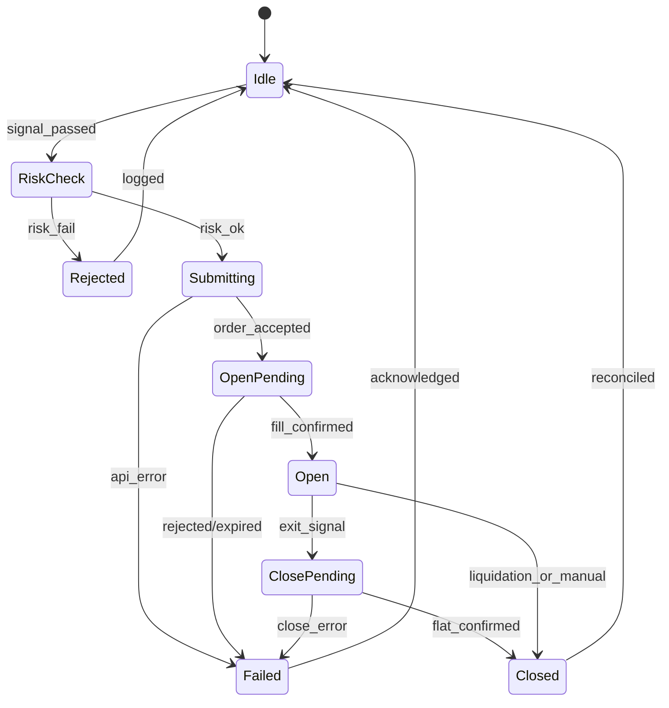

# Live trading phase — Delta India BTC perpetuals

Planning document for moving from **paper** BTC futures desk to **live** order placement on [Delta Exchange India](https://www.delta.exchange/) perpetuals. The current product ships **paper-only** for the BTC Future Trading module (signals, desk policy, Supabase history). Live Delta routes in this repo today serve **other** modules (e.g. options mirror, spot buy) — perps live is a **future phase**, not enabled on the paper desk path.

**Related docs**

- Deploy paper desk + Supabase: [DEPLOY.md](./DEPLOY.md)
- Paper tuning, metrics, replay: [PAPER_DESK_RUNBOOK.md](./PAPER_DESK_RUNBOOK.md)

---

## Scope and non-goals

| In scope (this phase) | Out of scope (until gated) |
|------------------------|----------------------------|
| Architecture, testnet, go-live criteria | Wiring `useBTCFuturesScalperEngine` to place real perp orders |
| Order state machine design | Copying paper fills 1:1 to exchange (slippage, partial fills, rejects) |
| Server-side key storage pattern | Client `localStorage` API keys for production perps |
| Kill switch + operational runbooks | Guaranteed profitability or market-making |

---

## 1) Delta India perps — API outline

The paper desk already consumes **public** India market data:

| Use | Base URL (current code) | Auth |
|-----|-------------------------|------|
| 1m klines / mark for paper | `https://api.india.delta.exchange` (override: `DELTA_API_BASE_URL`) | None (`/v2/history/candles`, tickers) |
| Signed trading (existing helpers) | `https://api.delta.exchange` or testnet via `deltaSign.ts` | HMAC-SHA256 (`api-key`, `timestamp`, `signature`) |

Optional: `DELTA_PROXY_URL` — reverse proxy on a fixed IP for exchange IP whitelist (see `/api/delta/myip`).

### Endpoints to implement for BTC perp live (v2)

Align with [Delta Exchange API docs](https://docs.delta.exchange/) (India product IDs differ from global — resolve via products API).

| Step | Method | Path (typical) | Purpose |
|------|--------|----------------|---------|
| Discover | `GET` | `/v2/products` | Filter `contract_type=perpetual_futures`, symbol e.g. `BTCUSD` |
| Balance | `GET` | `/v2/wallet/balances` | Available margin (already used in `/api/delta/account`) |
| Positions | `GET` | `/v2/positions/margined` | Reconcile open size vs internal book |
| Open orders | `GET` | `/v2/orders?state=open` | Reconcile resting orders |
| Place | `POST` | `/v2/orders` | Market/limit open; `product_id`, `size`, `side`, `order_type` |
| Cancel | `DELETE` | `/v2/orders/{id}` or batch | Kill switch / replace |
| Close | `POST` | `/v2/orders` | Reduce-only close or opposite side |
| History | `GET` | `/v2/fills`, `/v2/orders/history` | Audit, PnL reconciliation |

**Signing** (server-only): `signature = HMAC-SHA256(secret, method + timestamp + path + body)` — implemented in `client/src/lib/deltaSign.ts` (`deltaFetch`, `deltaPost`).

**Paper vs live boundary**

- **Paper:** `useBTCFuturesScalperEngine` → local state + `POST /api/paper-trades` (Supabase).
- **Live (future):** same signal/desk gates → **execution adapter** → Delta `POST /v2/orders` → persist **live** order/fill ids (new table or columns), never mix with paper `client_trade_id` without explicit mode flag.

---

## 2) Testnet path

Use Delta **testnet** before mainnet capital.

| Item | Testnet | Production |
|------|---------|------------|
| API base (`deltaSign.ts`) | `https://testnet-api.delta.exchange` | `https://api.delta.exchange` |
| Env flag | `DELTA_TESTNET=true` | unset or `false` |
| Keys | Testnet API key from Delta testnet dashboard | India live API key |
| IP whitelist | Testnet key restrictions + optional `DELTA_PROXY_URL` | Same; whitelist Vercel egress or proxy IP |

**Recommended flow**

1. Create testnet API key (trade + read; no withdraw).
2. Set server env on a **Preview** Vercel deployment or local: `DELTA_API_KEY`, `DELTA_API_SECRET`, `DELTA_TESTNET=true`.
3. Run execution adapter against testnet only; compare fills vs paper replay on same candle window ([runbook replay section](./PAPER_DESK_RUNBOOK.md)).
4. Soak test: 24–72h with kill switch drills (§6).
5. Flip to mainnet only after go-live gates (§3) — separate key, separate env project or protection rules.

**Note:** Public klines for paper may still use `api.india.delta.exchange`; testnet products/prices can diverge. For strict parity, point `DELTA_API_BASE_URL` at testnet public host if Delta documents one for India testnet.

Existing pattern (options module): client sends `x-delta-api-key`, `x-delta-api-secret`, `x-delta-testnet` headers to `/api/delta/*`. **Do not use this for production perps** — see §5.

---

## 3) Go-live gates (paper metrics)

Do not enable live perp placement until paper (and optionally testnet) evidence passes **all** gates you adopt. Suggested minimums (tune with your risk policy):

| Gate | Source | Suggested threshold (example) |
|------|--------|-------------------------------|
| Sample size | Supabase `paper_trades` / desk stats | ≥ 200 closed trades over ≥ 30 days |
| Expectancy | Desk profile **Expectancy** / export CSV | Mean net/trade > 0 after slippage env (`NEXT_PUBLIC_DESK_SLIPPAGE_BPS` ≥ 5) |
| Win rate + PF | Summary cards | Win rate stable; profit factor ≥ 1.1 over window |
| Fee drag | **Fee / \|gross\|** | Below agreed cap (e.g. < 35% of \|gross\|) |
| Drawdown behavior | Paper session peak DD | Max peak-to-trough ≤ 25% with lock behaving (entries pause, resume ~21%) |
| Skip hygiene | Desk profile skip counters | Spread/session/category skips not dominating entries |
| Strategy kill | P1-B auto-disable + manual disables | Losers disabled; no silent re-enable |
| Replay sanity | `npm run replay:compare` | No systematic sign flip vs live closes on same UTC days |
| Operational | Auth + deploy | [DEPLOY.md](./DEPLOY.md) checklist green; 2FA on exchange account |

Export for review: **Export CSV (30d)** and leaderboard — [PAPER_DESK_RUNBOOK.md](./PAPER_DESK_RUNBOOK.md).

Document gate results in a dated sign-off (spreadsheet or internal ticket) before `LIVE_TRADING_ENABLED=true`.

---

## 4) Order state machine (perp execution adapter)

Internal state should be **exchange-aware** (orders can rest, partial fill, reject). Suggested states:

| State | Meaning | Exchange actions |
|-------|---------|------------------|
| `Idle` | Flat, no working orders | — |
| `RiskCheck` | Desk gates (spread, session, category, DD lock, kill) | None |
| `Submitting` | Signed `POST /v2/orders` in flight | Create order |
| `OpenPending` | Ack received, size not fully confirmed | Poll order/fills |
| `Open` | Position size matches target within tolerance | Monitor TP/SL/time exits |
| `ClosePending` | Exit order submitted | Reduce-only / opposite |
| `Closed` | Flat; realized PnL recorded | — |
| `Failed` | Error; may need manual reconcile | Cancel orphans |
| `Rejected` | Pre-trade risk blocked (no API call) | — |

**Idempotency:** client order id / `client_order_id` in DB; retry only with same id. **Reconcile** job: periodic `GET positions` + `GET open orders` vs internal book.

Map paper `exitReason` (TP, SL, TIME, …) to live exit path separately — live may use exchange brackets where supported.

---

## 5) API key storage (server only)

| Practice | Detail |
|----------|--------|
| **Store** | `DELTA_API_KEY`, `DELTA_API_SECRET` in Vercel **server** env (or secrets manager); optional `DELTA_TESTNET` |
| **Never** | `NEXT_PUBLIC_DELTA_*`, commit to git, or log full signatures |
| **Permissions** | Trade + read; **no withdraw**; IP whitelist to proxy or known egress |
| **Rotation** | Rotate keys on schedule; dual-key cutover window |
| **Per user** | If multi-tenant later: encrypt at rest per user; this app today is single-operator |

**Migration from today:** Options-style headers (`x-delta-api-key` from browser) are acceptable for experiments only. Perps live must use **server env only** and session auth to **your** backend, not user-pasted keys in the client for production.

Reference implementation paths: `client/src/lib/deltaSign.ts`, `client/src/app/api/delta/account/route.ts`.

---

## 6) Kill switch

Layered stops — any one should block **new** live orders; upper layers cancel working orders.

| Layer | Mechanism | Paper today | Live (to build) |
|-------|-----------|-------------|------------------|
| **Operator** | UI “Pause” / emergency button | `pauseEntries` in engine | `LIVE_KILL_SWITCH=1` env + UI → halt adapter |
| **Drawdown** | Session peak equity DD | Pause entries ≥ 25%, resume ≤ ~21% | Same logic on **live equity** from exchange |
| **Strategy** | Auto-disable + manual list | P1-B + leaderboard disable | Do not submit for disabled `strategy_id` |
| **API / infra** | Health | Data feed warning | Cancel all `open` orders via API; stop cron |
| **Exchange** | Delta dashboard | — | Manual cancel all; revoke API key |

**Live kill procedure (draft)**

1. Set `LIVE_KILL_SWITCH=true` (server env) or hit admin endpoint.
2. `DELETE` / cancel all open orders for BTC perp product.
3. Optional: flatten positions (market reduce-only) if policy requires flat book.
4. Alert operator; post-mortem before re-enable.

Paper desk kill metrics and env: [PAPER_DESK_RUNBOOK.md](./PAPER_DESK_RUNBOOK.md) (auto-disable, drawdown, pause).

---

## 7) Disclaimers

- **Not financial advice.** This software is for education and research; you are responsible for compliance with Indian regulations, exchange terms, and tax reporting.
- **Capital at risk.** Live perpetual futures can lose more than intended; leverage amplifies losses. Testnet does not remove logic bugs.
- **Paper ≠ live.** Paper uses modeled fills (slippage env, mark/last rules); live has latency, partial fills, funding, fees, and halts. Past paper performance does not predict live results.
- **No warranty.** Provided as-is; outages, API changes, or bugs can cause missed exits or duplicate orders without a tested kill switch.
- **API keys.** Compromised keys can trade your account; use IP whitelist, no withdraw permission, and server-only storage.
- **Automation.** Unattended bots are high risk; define max daily loss and manual oversight before go-live.

---

## 8) Paper → live checklist

Use with [DEPLOY.md](./DEPLOY.md) (paper cloud) and this document (live phase).

### Paper production (prerequisite)

- [ ] Paper desk deployed; Supabase auth + migrations 001/002
- [ ] Sign-in, close trade, `paper_trades.account_key` = user UUID
- [ ] Leaderboard + CSV export working signed in
- [ ] Prod `NEXT_PUBLIC_DESK_*` per [DEPLOY.md](./DEPLOY.md); replay UI off
- [ ] Go-live **paper metrics** gates (§3) documented and passed

### Testnet live (execution adapter)

- [ ] `DELTA_API_KEY` / `DELTA_API_SECRET` server-only; `DELTA_TESTNET=true`
- [ ] IP whitelist / `DELTA_PROXY_URL` verified (`/api/delta/myip`)
- [ ] Order state machine + idempotency + reconcile job implemented
- [ ] Kill switch tested (env flag + cancel all)
- [ ] Min size / product_id for BTCUSD perp validated on testnet
- [ ] Soak: no orphan orders; fills match internal book

### Mainnet live (capital)

- [ ] Separate mainnet API key; withdraw disabled
- [ ] `DELTA_TESTNET` unset on production project
- [ ] `LIVE_TRADING_ENABLED` (or equivalent) only after sign-off
- [ ] Max notional / max daily loss caps enforced server-side
- [ ] Monitoring: balance, open orders, error rate, kill switch path
- [ ] Runbook: incident response, key rotation, rollback to paper-only

### Ongoing

- [ ] Weekly: export CSV, leaderboard review, replay compare sample days
- [ ] After desk env changes: re-run paper soak before touching live flags

---

## P3-A implemented (testnet execution scaffold)

Server-only Delta **testnet** adapter — no mainnet, no UI order placement, paper desk unchanged.

| Piece | Path |
|-------|------|
| Client + signing | `client/src/server/delta/deltaClient.ts` |
| Types | `client/src/server/delta/deltaTypes.ts` |
| Env guards | `client/src/server/delta/deltaConfig.ts` |
| Operator ping | `POST /api/delta/testnet/ping` (Supabase session required) |

### Server environment (testnet only)

| Variable | Required | Notes |
|----------|----------|--------|
| `DELTA_API_KEY` | Yes | Testnet API key — **never** `NEXT_PUBLIC_*` |
| `DELTA_API_SECRET` | Yes | Testnet secret |
| `DELTA_TESTNET` | Yes | Must be `true` or `1` — adapter **refuses** otherwise (no mainnet) |
| `DELTA_PROXY_URL` | No | Optional reverse proxy base (IP whitelist) |

Paper desk / Supabase auth (for ping): `NEXT_PUBLIC_SUPABASE_URL`, `NEXT_PUBLIC_SUPABASE_ANON_KEY` — see [DEPLOY.md](./DEPLOY.md).

### Operator verify

1. Sign in to the app (magic link).
2. `POST /api/delta/testnet/ping` with session cookie (e.g. from browser devtools or `curl` with cookies).
3. Expect `{ ok: true, testnet: true, balanceSnippet: [...] }`.

Wrappers exposed: `getBalances`, `getPositions`, `getOpenOrders`, `placeOrder`, `cancelOrder` — for future execution adapter only; **not** called from the BTC paper UI in P3-A.

### Tests

`client/src/server/delta/deltaClient.test.ts` — HMAC signature + mocked HTTP (no live Delta calls in CI).

---

## P3-B implemented (manual testnet ops panel)

Operator-only manual orders on **testnet** — not wired to `useBTCFuturesScalperEngine` or paper signals.

| Piece | Path |
|-------|------|
| Place order | `POST /api/delta/testnet/place-order` |
| Cancel order | `POST /api/delta/testnet/cancel-order` |
| Positions + open orders | `GET /api/delta/testnet/positions` |
| UI panel | `TestnetOpsPanel.tsx` (when `NEXT_PUBLIC_DESK_TESTNET_OPS=1`) |
| Audit | In-memory + optional `delta_audit_log` (`004_delta_audit_log.sql`) |
| Rate limit | 10 `place-order` / user / hour (in-memory) |

### Additional env

| Variable | Value | Notes |
|----------|-------|--------|
| `NEXT_PUBLIC_DESK_TESTNET_OPS` | `1` | Shows testnet panel on BTC futures desk |
| `DELTA_API_KEY` / `DELTA_API_SECRET` | testnet keys | Server only |
| `DELTA_TESTNET` | `1` or `true` | Required for all testnet routes |

Place/cancel/positions routes also require `NEXT_PUBLIC_DESK_TESTNET_OPS=1` (403 otherwise). `POST /api/delta/testnet/ping` remains available for connectivity checks when signed in.

### UI

Enable ops panel → sign in → **Desk profile** area shows amber **TESTNET ONLY** banner: refresh balances, place small **BTCUSD** market/limit order, list/cancel open orders.

### Tests

- `deltaTestnetSchemas.test.ts` — Zod bodies
- `deltaTestnetRateLimit.test.ts` — hourly cap
- `deltaTestnetRoutes.test.ts` — route handlers with mocked guards + client

---

## P3-C implemented (paper shadow intents)

When `NEXT_PUBLIC_DESK_SHADOW_INTENTS=1` and the user is signed in, each paper **close** appends a row to `shadow_trade_intents` (migration `005_shadow_trade_intents.sql`). Optional opens when `NEXT_PUBLIC_DESK_SHADOW_LOG_OPEN=1`. **No** `placeOrder` call.

| Piece | Path |
|-------|------|
| Mapper + client sync | `shadowTradeIntentMapper.ts`, `shadowTradeIntentSync.ts` |
| API | `POST/GET /api/shadow-trade-intents` |
| UI | `ShadowIntentLogPanel` — collapsible **Shadow log (last 20)** in desk profile |
| `would_place_testnet` | Server: `DELTA_TESTNET` + keys configured (shadow only) |

### Env

| Variable | Notes |
|----------|--------|
| `NEXT_PUBLIC_DESK_SHADOW_INTENTS` | `1` = enable logging + panel |
| `NEXT_PUBLIC_DESK_SHADOW_LOG_OPEN` | `1` = also log paper opens |

Requires Supabase auth + service role (same as paper trades). RLS: authenticated users `SELECT` own `user_id`.

### Tests

`shadowTradeIntentMapper.test.ts`, `shadow-trade-intents/route.test.ts` (mocked Supabase).

---

## Document map

| Doc | Role |
|-----|------|
| [DEPLOY.md](./DEPLOY.md) | Vercel + Supabase paper deploy |
| [PAPER_DESK_RUNBOOK.md](./PAPER_DESK_RUNBOOK.md) | Desk env, tuning, metrics, replay |
| **LIVE_TRADING_PHASE.md** (this file) | Delta perps live outline, gates, safety |
