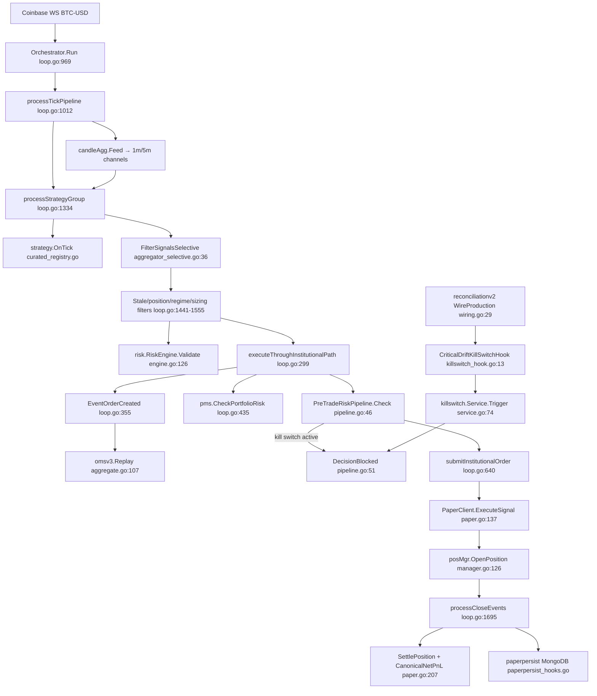

# MOCK EXECUTION CALL GRAPH

## Stage Reference Table

| Stage | File | Function | Caller | Callee | Status |
|-------|------|----------|--------|--------|--------|
| Boot | `cmd/antigravity/main.go` | `main()` | OS | orchestrator, recon | OK |
| Market data | `main.go:416` | Coinbase Connect | main | `Orchestrator.Run` | OK |
| Strategy tick | `loop.go:1334` | `processStrategyGroup` | Run/candle goroutines | `Strategy.OnTick` | OK |
| Aggregation | `aggregator_selective.go:36` | `FilterSignalsSelective` | processStrategyGroup | approved signals | OK |
| Risk legacy | `risk/engine.go:126` | `Validate` | processStrategyGroup | continue or pass | OK |
| OMS v3 | `loop.go:346` | `executeThroughInstitutionalPathWithFill` | processStrategyGroup | ledger events | OK |
| Kill gate | `risk/gate/pipeline.go:46` | `Check` | institutional path | PaperClient or BLOCK | **Was BLOCKED** |
| Mock broker | `execution/paper.go:137` | `ExecuteSignal` | submitInstitutionalOrder | applyFill | OK when unblocked |
| Positions | `positions/manager.go:126` | `OpenPosition` | openAndTrackPosition | SL/TP checks | OK |
| PnL | `loop.go:1695` | `processCloseEvents` | CloseEvents channel | Mongo persist | OK |
| Reconciliation | `reconciliationv2/engine.go:61` | `RunDomain` | scheduler | kill hook | **Was false CRITICAL** |
