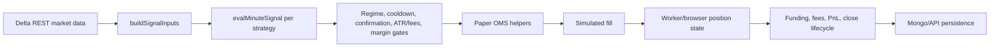
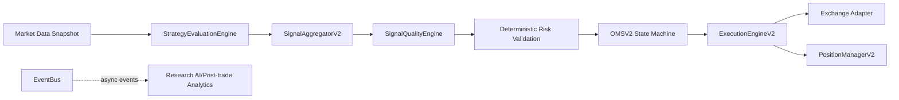

# Execution Flow Report

Generated: 2026-05-31

## Current Execution Path

The server worker path is `client/src/lib/paperDeskWorker/runPaperDeskPollTick.ts`.

The browser path is `client/src/hooks/useBTCFuturesScalperEngine.ts`.

## Component Latency And Blocking Points

- Market data: `fetchDeltaKlines()` blocks on two Delta REST calls before strategy evaluation. Timeout is 9000 ms.
- Indicator build: `buildSignalInputs()` is synchronous CPU work over recent OHLCV arrays.
- Strategy evaluation: `evalMinuteSignal()` runs inline in a for-loop over active strategies.
- Aggregation: current browser path sorts `entryCandidates` by priority, but worker path opens candidates inline and lacks full browser parity.
- Risk and gates: regime, cooldown, confirmation, ATR/fee, margin, spread, burst, same-side, and category gates are spread across worker and hook logic.
- OMS: existing `paperOms.ts` is pure and useful, but state names are paper-specific (`NEW`, `RISK_CHECKED`, `ACCEPTED`, `SIMULATED_FILL`, etc.).
- Execution: current paper execution fills immediately at mark price. Live Delta testnet helpers exist in `client/src/server/delta/deltaClient.ts`, but are not a unified adapter layer.
- Persistence/reporting: Mongo/API writes and UI polling are outside the critical paper fill math, but still share surrounding engine code.

## External Dependencies In Or Near Execution

- Delta REST market data in `runPaperDeskPollTick.ts`.
- Browser klines API fetches in `useBTCFuturesScalperEngine.ts`.
- Paper state, trace, funnel, and trade persistence API calls around the browser engine.
- Delta testnet REST trading helpers in `client/src/server/delta/deltaClient.ts`.
- AI insight polling in `client/src/hooks/useAIInsights.ts` is display/research-only in this repo; no import path was found from the paper worker or BTC futures hook into `useAIInsights`.

## AI Execution Dependency Finding

No active LLM approval/veto call was found in the current BTC futures paper execution path in this repo. The AI artifacts found are UI/research-oriented:

- `client/src/hooks/useAIInsights.ts` polls `/api/ai/insights`.
- `client/src/components/AIInsightPanel.tsx` renders bull/bear/macro/risk review cards.
- `client/src/lib/QuantAIAgent.ts` is a stub research report generator.
- Strategy “approved IDs” in mock research are deterministic research/ranking filters, not LLM approvals.

## Bottlenecks

- Market data fetch dominates latency and can block up to 9000 ms.
- Worker strategy evaluation is sequential.
- Worker and browser execution gate parity is incomplete.
- OMS states are paper-specific and do not model live order lifecycle states.
- Exchange code is Delta-specific and not isolated behind a common adapter.
- Diagnostics and persistence are interleaved with execution code.

## V2 Target Flow

AI is explicitly outside the V2 live execution path and belongs only to `client/src/internal/research_ai`.
