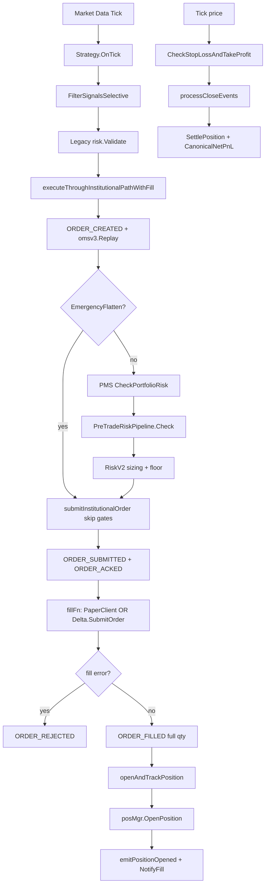

# EXECUTION_CALL_GRAPH.md
## Live Capital Certification — Complete Execution Call Graph

**Audit Date:** 2026-06-09  
**Scope:** Go engine institutional path (BTC paper + Delta live)  
**Method:** Source-code trace only — no runtime assumptions

---

## Primary Autonomous Path (BTC Futures — Go Engine)

```
Market Tick/Candle
  └─ engine/internal/trading/loop.go:Orchestrator.Run (L969)
       └─ processTickPipeline (L1012) | process1mCandles (L1050) | process5mCandles (L1065)
            └─ processStrategyGroup (L1334)
                 ├─ SIGNAL GENERATED
                 │    └─ e.Strategy.OnTick(t) (L1358)
                 │         Input:  marketdata.Tick
                 │         Output: []strategy.Signal
                 │         Failure: strategy disabled → skip (L1354)
                 │
                 ├─ AGGREGATION
                 │    └─ o.aggregator.FilterSignalsSelective(rawSignals) (L1403)
                 │         Input:  []AggregatedSignal
                 │         Output: approved signals
                 │         Failure: empty → return (L1400)
                 │
                 ├─ LEGACY RISK (pre-OMS)
                 │    └─ o.risk.Validate(sig) (L1546)
                 │         File: engine/internal/risk/engine.go:RiskEngine.Validate (L126)
                 │         Failure: rejected → no execution (L1546–1552)
                 │
                 └─ INSTITUTIONAL EXECUTION
                      └─ executeThroughInstitutionalPath (L299 → L1629)
                           └─ executeThroughInstitutionalPathWithFill (L346)
```

### Institutional Path Detail

| Stage | File | Function | Line | Input | Output | Failure Conditions |
|-------|------|----------|------|-------|--------|-------------------|
| ClientOrderID gen | `loop.go` | `executeThroughInstitutionalPathWithFill` | 355 | Signal | `AG-PAPER-{symbol}-{nano}` | — |
| Ledger store | `loop.go` | same | 356–360 | — | `ledger.Store` (MemoryStore default) | — |
| ORDER_CREATED | `loop.go` | `appendOrderEvent` | 384 | OrderPayload | ledger.Event | append error → return |
| OMS Mongo persist | `loop.go` | `persistOMSTransition` | 388–397 | OrderTransition | Mongo write | non-fatal |
| OMS REPLAY | `omsv3/aggregate.go` | `omsv3.Replay` | 402 (call) | events[] | OrderAggregate | invariant violation → return |
| ORDER_VALIDATED | `loop.go` | `appendOrderEvent` | 405 | OrderPayload | ledger.Event | append error |
| PMS GATE | `pms/portfolio_risk_budget.go` | `CheckPortfolioRisk` | 452 (call) | proposedDollarRisk, equity | violations[] | violations → EventRiskBlocked (L456–480) |
| RISK V2 GATE | `risk/gate/pipeline.go` | `PreTradeRiskPipeline.Check` | 484–500 | TradeRequest, Market, Metrics | Decision | blocked → EventRiskBlocked (L503–536) |
| ELITE GATE | `risk/drawdown.go` | `EvaluateDrawdownExecution` | 553 | stratMeta, drawdown | error | elite rejection (L564–588) |
| SIZING FLOOR | `risk/v2/sizing.go` | `EnforceExecutionFloor` | 594–599 | rec size | error | below 0.01 BTC → reject (L609–633) |
| SIZE APPLY | `loop.go` | same | 635–637 | rec | sig.TargetSize updated | — |
| RISK_APPROVED | `loop.go` | `submitInstitutionalOrder` | 651 | OrderPayload | ledger.Event | append error |
| ORDER_SUBMITTED | `loop.go` | same | 668 | OrderPayload | ledger.Event | append error |
| ORDER_ACKED | `loop.go` | same | 672–673 | ackPayload w/ synthetic ExchangeOrderID | ledger.Event | append error |
| BROKER FILL | `loop.go` | `fillFn` | 677 | sig, clientOrderID | FillResult | error → EventOrderRejected (L677–705) |
| ORDER_FILLED | `loop.go` | same | 707–710 | fillPayload (full qty) | ledger.Event | append error |
| POSITION OPEN | `loop.go` | `openAndTrackPosition` | 815 | fill, sig | Position | OpenPosition error |
| POS MANAGER | `positions/manager.go` | `OpenPosition` | 126 | sig, entryPrice | *Position | ValidateOpenSignal fail |
| LEDGER POS EVENT | `loop.go` | `emitPositionOpened` | 836 | position | ledger.Event | append error |
| RISK NOTIFY | `loop.go` | `o.risk.NotifyFill` | 1674 | sig | exposure update | — |
| PMS SYNC | `loop.go` | `syncPMSState` | 1678 | — | portfolio state | — |

---

## Exit Path (SL / TP / TIME — No Broker Order)

| Stage | File | Function | Line | Input | Output | Failure |
|-------|------|----------|------|-------|--------|---------|
| Price mark | `loop.go` | `posMgr.CheckStopLossAndTakeProfit` | 1036 | currentPrice | — | — |
| SL/TP eval | `positions/manager.go` | `checkLongPosition` / `checkShortPosition` | 209–258 | price vs SL/TP | CloseEvent | — |
| Close queue | `positions/manager.go` | `emitClose` | 268–274 | pos, reason, pnl | CloseEvent | — |
| Close consumer | `loop.go` | `processCloseEvents` | 1695 | CloseEvent | journal entry | ctx.Done |
| Balance settle | `execution/paper.go` | `SettlePosition` | 1704 | side, size, exitPrice | balance update | — |
| Fee calc | `execution/fees.go` | `CanonicalTradeFees` | 1705–1709 | entry, exit, size | FeeBreakdown | — |
| Net PnL | `execution/fees.go` | `CanonicalNetPnL` | 1710 | gross, fees | netPnL | — |
| Journal | `loop.go` | `o.journal.RecordTrade` | 1727 | JournalEntry | cache | — |
| Portfolio | `loop.go` | `portfolioLedger.RecordClose` | 1729–1736 | pnl, fees | ledger | — |
| Ledger close | `loop.go` | `emitPositionClosed` | 874+ | position | ledger.Event | — |

**Critical:** SL/TP exits are **software-monitored price hits** — no exchange stop/limit order is placed.

---

## External / Manual Execution Gateway

```
POST /api/execution/request (Next.js)
  └─ client/src/app/api/execution/request/route.ts (L34)
       └─ engine POST /api/execution/request
            └─ executiongateway/handler.go:Handler.ServeHTTP (L28)
                 └─ institutional_request.go:ProcessExecutionRequest (L15)
                      ├─ kill switch check (L16–20)
                      ├─ venue "paper" → processPaperExecutionRequest (L41)
                      │    └─ executeThroughInstitutionalPath (L71)
                      └─ venue "delta" → processDeltaExecutionRequest (L81)
                           └─ executeThroughInstitutionalPathWithFill (L133)
                                └─ fillFn → deltaBridge.SubmitOrder (L125)
                                     └─ delta/client.go:PlaceOrder (L182)
```

## Delta Options Mirror Path

```
Paper options open/close hook
  └─ main.go:SetOnOpenHook (L905–915)
       └─ delta/live_bridge.go:OnOpen (L252)
            └─ institutionalOpen handler REQUIRED (L296–303)
                 └─ institutional_request.go:WireDeltaBridge (L143)
                      └─ executeThroughInstitutionalPathWithFill (L212)
                           └─ bridge.SubmitOrder (L205)
                                └─ UpdateTradeAfterFill → DeltaOrderID (L177–187)
```

## Delta Live HTTP (Engine-Native)

```
POST /api/delta-live/order
  └─ engine/cmd/antigravity/main.go (L1489–1512)
       └─ ProcessExecutionRequest (L1509–1511)
            └─ [same institutional path as above]
```

---

## Bypass Paths (Documented)

| Path | Skips | Evidence |
|------|-------|----------|
| Emergency flatten | PMS + RiskV2 | `loop.go:409–422` (`EmergencyFlatten: true`) |
| Kill-switch CancelOpenOrders | OMS close orders | `killswitch_executor.go:34–47` — direct `posMgr.CloseAllPositions` |
| Paper OMS admin override | Full institutional stack | `paper_oms_handler.go:handleOpen` (requires `PAPER_OMS_ADMIN_OVERRIDE`) |
| Browser BTC paper desk | Entire Go engine | `client/src/hooks/useBTCFuturesScalperEngine.ts` — local paper math |
| Retired Next.js broker routes | — | All return 410 (`delta/spot`, `delta/mirror`, `delta/testnet/*`) |

---

## Call Graph Diagram



---

## Evidence Summary

| Question | Verdict | Key Gap |
|----------|---------|---------|
| Institutional path exists | **PASS** | All Go-engine execution routes through `executeThroughInstitutionalPathWithFill` |
| Exchange order ID in OMS | **FAIL** | Synthetic `paper-{clientOrderID}` only (`loop.go:672`) |
| Real Delta ID in OMS | **FAIL** | Stored only on `LiveTrade.DeltaOrderID` (`live_bridge.go:179`) |
| Partial fill support (live) | **FAIL** | `EventOrderPartial` never emitted in live loop |
| Orchestrator ledger durable | **FAIL** | `SetEventLedger` never called from `main.go`; defaults to MemoryStore (`loop.go:232`) |
