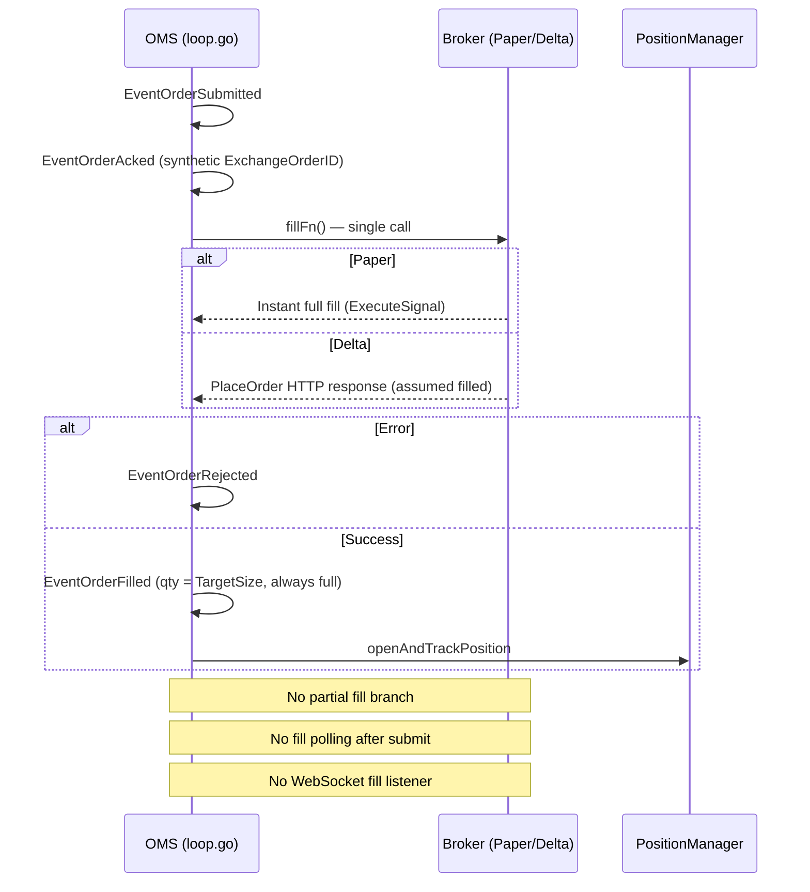

# FILL_MANAGEMENT_REPORT.md
## Phase 3 — Fill Management Audit

**Audit Date:** 2026-06-09

---

## Fill Event Search Results

| Symbol | Found In | Used In Live Path? |
|--------|----------|-------------------|
| `EventOrderFilled` | `loop.go:710` | **YES** |
| `EventOrderPartial` | `omsv3/aggregate.go:132`, `ledger/order_projection.go:74` | **NO** (live) |
| `EventOrderRejected` | `loop.go:682` | **YES** |
| `EventOrderAcked` | `loop.go:673` | **YES** (pre-fill) |
| `FillPoller` | — | **NOT FOUND** |
| `WebSocketFill` | — | **NOT FOUND** |
| `ExecutionReport` | — | **NOT FOUND** |
| `TradeUpdate` | — | **NOT FOUND** |
| `SimulatePartialFill` | `execution/paper_exchange_adapter.go:115` | **NO** (test/backtest only) |

---

## Broker Fill Lifecycle Diagram

---

## Fill Type Certification

| Fill Type | Expected Behavior | Actual Behavior | Verdict |
|-----------|-------------------|-----------------|---------|
| **Partial fills** | Accumulate qty, update position incrementally | OMS schema supports; live loop always full fill (`loop.go:708`) | **FAIL** |
| **Multiple fills** | Sum fills per order | Single fill event only | **FAIL** |
| **Delayed fills** | Poll/wait for confirmation | Ack before fill; no wait | **FAIL** |
| **Rejected fills** | EventOrderRejected, no position | Implemented (`loop.go:677–705`) | **PASS** |
| **Cancelled fills** | EventOrderCancelled | Only on reject path (OMS transition) | **PARTIAL** |
| **Expired orders** | Cancel + alert | Not implemented for live broker orders | **FAIL** |

---

## Critical Questions

### Does broker execution assume immediate fills?

**YES — FAIL for live capital**

Evidence:
- `execution/paper.go:137` — `ExecuteSignal` returns instant fill
- `loop.go:672–710` — ACK emitted, then single `fillFn` call, then `EventOrderFilled` with `FillQuantity = sig.TargetSize`
- Delta: `delta/client.go:182` — HTTP PlaceOrder; response treated as complete fill

### Does execution wait for confirmation?

**NO — FAIL**

No fill poller, no order status check, no WebSocket listener found in engine.

### Can position size become incorrect?

**YES — under partial/delayed fill scenarios**

If Delta returns partial fill at REST level, OMS records full `TargetSize` (`loop.go:708`) while broker may have filled less.

`emitPartialTakeProfit` exists (`positions/manager.go:277`) but has **zero callers** in engine.

### Can PnL drift?

**YES — under fill mismatch**

- Open position sized to full `TargetSize` regardless of actual fill
- Delta bridge PnL: `(exit-entry) × contracts` (`live_bridge.go:169–171`) — no fee deduction
- No reconciliation of fill qty vs position qty in production

---

## Paper vs Delta Fill Semantics

| Aspect | Paper | Delta Live |
|--------|-------|------------|
| Fill model | Instant atomic (`paper.go:120 applyFill`) | REST PlaceOrder response |
| Partial support | Adapter exists, unused | Not handled |
| Fee at fill | Deducted at fill (`paper.go:99–131`) | Not in bridge PnL |
| Slippage | Mode multipliers / OMS bps (`paper_oms.go:230–249`) | Market order, no slippage model |
| Exchange ID in OMS | Synthetic | Real ID in `LiveTrade.DeltaOrderID` only |

---

## Fill Management Verdict: **FAIL**

Live execution path assumes immediate, complete fills. OMS partial-fill infrastructure exists but is disconnected from production. Position size and PnL can drift under real exchange partial/delayed fill behavior.
