# PNL_CERTIFICATION.md
## Phase 9 — PnL Validation Audit

**Audit Date:** 2026-06-09  
**Verdict: PARTIAL**

---

## PnL Trace: Fill → Position → PnL

### Engine (Go) — BTC Paper Institutional Path

```mermaid
flowchart LR
    A[ORDER_FILLED full qty] --> B[openAndTrackPosition]
    B --> C[posMgr tracks entry]
    C --> D[Tick: CheckStopLossAndTakeProfit]
    D --> E[calculatePnL gross]
    E --> F[processCloseEvents]
    F --> G[SettlePosition balance]
    G --> H[CanonicalTradeFees]
    H --> I[CanonicalNetPnL]
    I --> J[journal + portfolioLedger + Mongo]
```



---

## Open (Unrealized) PnL

**Engine:** Position manager tracks entry; unrealized computed at mark price on tick (implicit via SL/TP check).

**Client:** `futuresDeskRuntime.ts:80`:
```
unrealizedPnL = paperLinearGrossPnl(entryPrice, markPrice, notional, side)
```

---

## Closed (Realized) PnL — Engine

### Gross PnL

`positions/manager.go:261–265`:
```
LONG:  (exitPrice - entryPrice) × size
SHORT: (entryPrice - exitPrice) × size
```

### Fee Model

`execution/fees.go:14–26`:
```
entry_fee = entryPrice × quantity × 0.0005   // 5 bps taker
exit_fee  = exitPrice  × quantity × 0.0005
```

### Net PnL

`execution/fees.go:30–31`:
```
netPnL = grossPnL - entry_fee - exit_fee
```

Applied at: `loop.go:1705–1710`:
```go
feeBreakdown := execution.CanonicalTradeFees(...)
netPnL := execution.CanonicalNetPnL(event.PnL, feeBreakdown)
```

### Settlement

`execution/paper.go:210–234` — `SettlePosition` updates paper balance on close.

---

## Closed PnL — Client (Browser Paper Desk)

`futuresPaperMath.ts:483–490`:
```
grossPnl = paperLinearGrossPnl(entry, slippedExit, notional, side)
fees     = notional × takerFeePct × 2
netPnl   = grossPnl - fees - fundingCosts
```

Slippage: `futuresPaperMath.ts:28–37` — bps entry/exit adjustment.

Canonical Mongo: `portfolioAccountingFees.ts:27–35` mirrors engine fee legs.

---

## Slippage Models

| Path | Model | File:Line |
|------|-------|-----------|
| Engine OMS | 5 bps default | `execution/paper_oms.go:230–249` |
| Engine PaperClient | Mode multipliers | `execution/paper.go:75–88` |
| Client paper | bps entry/exit | `futuresPaperMath.ts:28–37` |
| Delta live | None in PnL | — |

---

## Partial Fill PnL Impact

| Path | Partial Fill PnL | Verdict |
|------|------------------|---------|
| Engine live | N/A — always full fill | **N/A** |
| Engine backtest | `SimulatePartialFill` in adapter | Test only |
| Client replay | 50% at TP1 (`futuresReplayEngine.ts:264–328`) | Browser only |
| Delta live | Not handled | **FAIL** |

---

## Delta Live PnL

`live_bridge.go:168–172`:
```
buying:  RealizedPnl = (closePrice - fillPrice) × contracts
selling: RealizedPnl = (fillPrice - closePrice) × contracts
```

**Gaps:**
- No exchange fee deduction
- No slippage model
- No funding cost
- Assumes fill prices from REST response are authoritative

---

## PnL Drift Scenarios

| Scenario | Can PnL Drift? | Evidence |
|----------|----------------|----------|
| Fee double-count | **LOW** (engine) | Single `CanonicalNetPnL` at close |
| Fee omission (Delta) | **YES** | No fees in bridge PnL |
| Partial fill mismatch | **YES** | Full size PnL on partial fill |
| Gross/net confusion | **LOW** (engine) | Separate gross in event.PnL, net in journal |
| Browser vs engine fork | **YES** | Parallel paper desks with different paths |
| Funding accrual | **PASS** (client) | Invariant preserved per trading-app rules |
| Negative PnL from accounting bug | **LOW** (engine) | Straight arithmetic; tested in `futuresPaperMath.test.ts` |

---

## PnL Double-Count Risk

- Order events use idempotency keys (`loop.go:729`)
- Single `processCloseEvents` consumer per close event
- No async fill listener that could duplicate

**Risk:** If broker reports fill after software SL close, no mechanism to adjust PnL.

---

## Test Coverage

| Test File | Coverage |
|-----------|----------|
| `client/src/lib/futuresPaperMath.test.ts` | Gross, fees, net, funding |
| `engine/internal/execution/fees.go` | Canonical fee legs |
| `engine/internal/ledger/replay_correctness_test.go` | Order projection PnL fields |

---

## PnL Certification Matrix

| Component | Verdict |
|-----------|---------|
| Engine open PnL | **PASS** |
| Engine closed PnL | **PASS** |
| Engine fees | **PASS** |
| Engine slippage (OMS) | **PASS** |
| Client paper PnL | **PASS** (tested, separate path) |
| Delta live PnL | **FAIL** (no fees, no partial) |
| Partial fill PnL | **FAIL** (not implemented live) |
| Cross-system PnL consistency | **PARTIAL** |

**Overall: PARTIAL** — Paper math is sound and tested. Delta live PnL is simplified and disconnected from institutional fee model.
