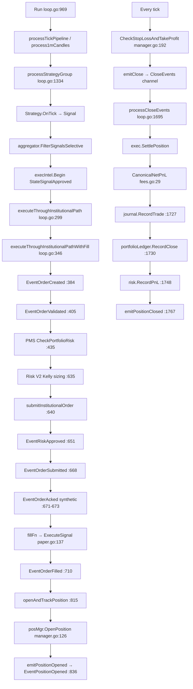

# Execution Trace Report

**Audit date:** 2026-06-09  
**Method:** Symbol search + call-chain tracing from source

---

## Symbol Search Results

| Symbol | Found | Primary Location |
|--------|-------|------------------|
| `ExecuteSignal` | ✅ | `engine/internal/execution/paper.go:137`; `binance_live.go:31` |
| `FillEvent` | ❌ | Not in BTC hot path |
| `OrderFilled` | ✅ | `ledger.EventOrderFilled`; `execintel.StateOrderFilled` |
| `PositionOpened` | ✅ | `ledger.EventPositionOpened`; `emitPositionOpened` `loop.go:836` |
| `PositionClosed` | ✅ | `ledger.EventPositionClosed`; `emitPositionClosed` `loop.go:874` |
| `UpdatePnL` | ❌ | Replaced by `RecordPnL`, `RecordClose`, `CanonicalNetPnL` |
| `MarkToMarket` | ❌ (BTC) | Implicit via tick price; options only `options/engine.go:831` |
| `OMS` | ✅ | `omsv3/`, `paperOms.ts` |
| `Replay` | ✅ | `ledger/replay.go`, `futuresReplayEngine.ts` |
| `Ledger` | ✅ | `engine/internal/ledger/` |

---

## Path A — Go Engine Institutional Path (Primary)

### Full Execution Graph



### Hop-by-Hop Trace Table

| Step | Caller | File | Line | Next Hop |
|------|--------|------|------|----------|
| 1. Signal Generated | `processStrategyGroup` | `loop.go` | 1358 | `aggregator.FilterSignalsSelective` |
| 2. Risk Approved | `executeThroughInstitutionalPathWithFill` | `loop.go` | 651 | `appendOrderEvent(EventRiskApproved)` |
| 3. OMS Record Created | same | `loop.go` | 384 | `EventOrderCreated` + `persistOMSTransition(OMSNew)` |
| 4. Order Submitted | `submitInstitutionalOrder` | `loop.go` | 668 | `EventOrderSubmitted` |
| 5. Broker Accepted | same | `loop.go` | 671–673 | **Synthetic** `ExchangeOrderID = "paper-" + clientOrderID` |
| 6. Fill Received | `fillFn` → `PaperClient.ExecuteSignal` | `paper.go` | 137 | `applyFill` balance math |
| 7. Position Updated | `openAndTrackPosition` | `loop.go` | 816 | `posMgr.OpenPosition` |
| 8. Portfolio Updated | `processCloseEvents` | `loop.go` | 1730 | `portfolioLedger.RecordClose` |
| 9. PnL Updated | same | `loop.go` | 1705–1748 | `CanonicalNetPnL` → `risk.RecordPnL` |

### Proven Gaps in Path A

| Gap | Evidence | Impact |
|-----|----------|--------|
| Synthetic ACK before broker | `loop.go:671–673` sets `ExchangeOrderID = "paper-" + clientOrderID` **before** `fillFn` | Real exchange IDs not in ledger for Delta |
| Instant full fill | `fillPayload.FillQuantity = sig.TargetSize` `:708` — no partial | Orphan risk on partial exchange fills |
| No `UpdatePnL` on open | PnL only on close via `processCloseEvents` | Unrealized PnL not ledger-backed |

**Path A Verdict:** **PASS** for paper-engine closed loop; **FAIL** for broker-attested execution.

---

## Path B — Delta Institutional Path

| Step | Caller | File | Line | Next Hop |
|------|--------|------|------|----------|
| External request | `ProcessExecutionRequest` | `institutional_request.go` | 15 | venue switch |
| Delta routing | `processDeltaExecutionRequest` | same | 81–140 | `executeThroughInstitutionalPathWithFill` |
| Broker fill | `fillFn` closure | same | 117–131 | `deltaBroker.SubmitOrder` |
| Bridge open | `SetInstitutionalOpenHandler` | same | 155–218 | `bridge.SubmitOrder` via fillFn |
| Bridge close | `SetInstitutionalCloseHandler` | same | 219–264 | `bridge.SubmitReduceOnlyOrder` |

**Delta Path Verdict:** Routes through institutional gates (**PASS**). Assumes REST synchronous full fill (**FAIL**). No exchange stop orders — SL/TP only in-engine for BTC scalper, not on Delta options (**FAIL**).

---

## Path C — Next.js Paper Desk Worker

| Step | Caller | File | Line | Next Hop |
|------|--------|------|------|----------|
| Cron tick | `/api/cron/paper-desk-tick` | `route.ts` | — | `runPaperDeskPollTick` |
| Exit check | `runPaperDeskPollTick` | `runPaperDeskPollTick.ts` | 554–567 | `paperResolveHardExit` |
| PnL booking | same | same | 578–583 | inline gross/fees/net (not `paperNetPnlOnClose`) |
| Signal eval | same | same | 688 | `evalMinuteSignal` |
| OMS create | same | same | 753 | `markSimulatedFill` |
| Position open | same | same | 763 | `markPositionOpened` |

**Worker PnL inconsistency:** Worker uses inline `gross - fees - fundingCosts` (`:581–583`) while hook uses `paperNetPnlOnClose` (`useBTCFuturesScalperEngine.ts:2577`). Formulas are equivalent but `minAbsNetWinUsd` bump exists only in hook path.

**Path C Verdict:** **PASS** for deterministic paper simulation; **FAIL** — not the same runtime as Go engine Path A.

---

## Path D — OMS v3 Event Projection

| Step | File | Function | Line |
|------|------|----------|------|
| Event append | `ledger/store.go` | `Append` | 38–69 |
| Order replay | `omsv3/aggregate.go` | `Replay` | 107–117 |
| Fill → state | `omsv3/aggregate.go` | `stateFromEvent` | 120–142 |
| Position projection | `omsv3/projections.go` | `applyPositionEvent` | 504–546 |
| Partial fill (backtest only) | `backtest/v3/oms_bridge.go` | `RecordOrderPartialFill` | 83 |

**Path D Verdict:** **PASS** in tests/certification; **FAIL** on live path (no `EventOrderPartial` emission).

---

## Path E — Emergency Flatten

| Step | Caller | File | Line |
|------|--------|------|------|
| Kill switch trigger | `killswitch.Service` | `killswitch/service.go` | — |
| Flatten | `KillSwitchExecutor.FlattenPositions` | `killswitch_executor.go` | 50–81 |
| Institutional bypass | `ExecuteEmergencyFlatten` | `loop.go` | 330–343 |
| PMS skip | `EmergencyFlatten: true` opt | `loop.go` | 409–422 |

**Path E Verdict:** **PASS** — refuses direct `ExecuteSignal` bypass when orchestrator unavailable (`killswitch_executor.go:74`).

---

## Execution Graph Summary

```
┌─────────────────────────────────────────────────────────────────┐
│                     SIGNAL SOURCES                               │
├──────────────────────┬──────────────────────────────────────────┤
│ Go 606 strategies    │ Client 108 strategies (separate runtime) │
└──────────┬───────────┴──────────────┬───────────────────────────┘
           │                          │
           ▼                          ▼
   institutional path          paperDeskWorker / hook
   (loop.go)                   (runPaperDeskPollTick.ts)
           │                          │
           ├─ paper fillFn ───────────┤ (different code paths)
           ├─ delta fillFn ───────────┘
           │
           ▼
   ledger event store → omsv3.Replay → Mongo OMS transitions
           │
           ▼
   positions.Manager → CloseEvents → PnL finalization
```

---

## Phase 2 Conclusion

| Requirement | Verdict | Evidence |
|-------------|---------|----------|
| Signal → Risk → OMS → Submit → Fill → Position → PnL chain exists | **PASS** | `loop.go` full chain |
| Chain is broker-attested | **FAIL** | Synthetic ack; REST assumed fill |
| Single execution path for all modes | **FAIL** | Go vs Next.js divergence |
| Partial fill handling on live path | **FAIL** | Only backtest emits `EventOrderPartial` |

**Overall Phase 2:** **FAIL** for capital-grade execution integrity.
