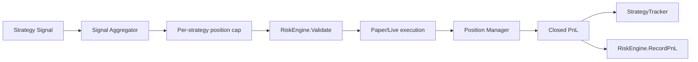

# Risk Audit Report

Generated: 2026-05-31

## Scope

Audited the Go execution engine and the client-side paper risk helpers:

- `engine/internal/risk/engine.go`
- `engine/internal/risk/strategy_tracker.go`
- `engine/internal/trading/loop.go`
- `engine/internal/positions/manager.go`
- `engine/internal/execution/paper.go`
- `engine/internal/execution/paper_oms.go`
- `client/src/lib/RiskEngine.ts`

## Current Risk Checks

Existing controls:

- BTC-only symbol guard.
- Net BTC exposure cap.
- Max capital/notional cap.
- Daily loss circuit breaker.
- High-exposure confidence guard.
- Per-strategy position cap in `positions.Manager`.
- Fixed stop-loss/take-profit lifecycle in `positions.Manager`.
- Strategy-level cooldown/disable from loss streak, daily loss, and poor live win rate.
- Paper fee accounting and mark-to-market equity in `execution.PaperClient`.
- Client mock risk metrics for VaR, expected shortfall, concentration, leverage, and stress testing.

## Missing Controls Before This Phase

- Portfolio heat across open positions.
- Gross, net, long, and short exposure controls.
- Correlation matrix and correlation blocker.
- VaR/CVaR as execution gates.
- Strategy family risk budgets.
- Kelly sizing.
- Drawdown-aware sizing.
- Dynamic leverage recommendations.
- Regime exposure controls.
- Daily/weekly/monthly loss levels.
- Funding risk gate.
- Liquidation buffer model.
- Symbol, strategy, family, and exchange concentration controls.
- Stress testing and Monte Carlo models.
- Risk-of-ruin model.
- Persistent risk audit event schema.

## Overlapping Controls

- `RiskEngine.Validate()` had max capital and exposure checks; the new portfolio engine supersedes those with portfolio heat, exposure, leverage, concentration, and loss limits.
- `StrategyTracker` has strategy-level disable logic; the new `RiskBudgetBook` and `FamilyLimitBook` add family/portfolio budget control without replacing strategy health logic.
- `positions.Manager` has per-strategy open-position limits; the new correlation guard covers cross-strategy same-symbol stacking.

## Ineffective Or Incomplete Controls

- Existing correlation guard was a confidence check under high net exposure, not a real correlation matrix.
- Existing daily loss checks were account-level only and did not include weekly/monthly lockouts.
- Client `RiskEngine.ts` is useful for dashboard research but is not authoritative for the Go execution path.
- Existing OMS and position manager do not persist portfolio risk rejections or overrides permanently.

## Phase 2 Remediation

Added `engine/internal/risk` institutional portfolio risk modules and wired `RiskEngine.Validate()` through `PortfolioRiskEngine.ValidateTrade()`.

The current execution path now goes through the new portfolio risk decision before execution. Full precision still improves once the trading loop passes strategy family, exchange, funding, regime, and live open-position snapshots into the portfolio engine.
